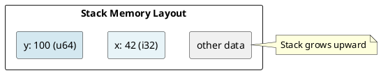
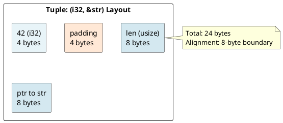
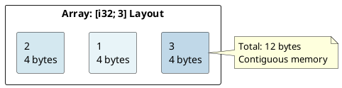
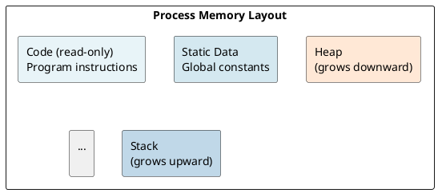
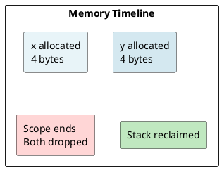

# Rust Fundamentals: Under the Hood

## Overview
Understanding Rust's fundamentals means knowing how the compiler sees your code: types, bindings, data layouts, and the memory model that enables safety.

---

## 1. Variables and Bindings

### The Binding Model
In Rust, a `let` statement creates a **binding**: a name associated with a value and a type.

```rust
let x = 42;  // Type: i32, inferred
let y: u64 = 100;  // Type: u64, explicit
```

**Under the hood:**
- The compiler performs **type inference** to determine types
- Each binding occupies space on the **stack** (for primitive types)
- The binding name is **statically replaced** at compile time (no runtime name lookup)

### Stack Layout Example



---

## 2. Primitive Types and Their Layout

### Integer Types
Rust provides fixed-size integers: `i8`, `i16`, `i32`, `i64`, `i128`, `isize` (signed) and `u8`, `u16`, `u32`, `u64`, `u128`, `usize` (unsigned).

| Type | Size | Layout |
|------|------|--------|
| `i32` | 4 bytes | Binary two's complement |
| `u64` | 8 bytes | Binary unsigned |
| `isize` | Platform | Points to values, 32-bit or 64-bit |

**Example (Little-Endian x86-64):**
```rust
let n: i32 = 258;
// Memory: [02 01 00 00]  (little-endian)
// Bit pattern: 0x00000102
```

### Floating Point Types
`f32` (IEEE 754 single precision, 4 bytes) and `f64` (IEEE 754 double precision, 8 bytes).

```
f64 layout:
┌─ Sign (1 bit)
│ ┌─ Exponent (11 bits)
│ │       ┌─ Mantissa (52 bits)
│ │       │
[S|EEEEEEEEEEE|MMMMMM...MMMMMM]
```

### Boolean Type
```rust
let flag: bool = true;  // 1 byte (not 1 bit—compiler aligns to byte)
```

**Under the hood:** `true` is represented as `1`, `false` as `0`.

---

## 3. Compound Types

### Tuples
Tuples group values of potentially different types:

```rust
let pair: (i32, &str) = (42, "hello");
```

**Memory layout (x86-64):**



### Arrays
Fixed-size, homogeneous collections:

```rust
let arr: [i32; 3] = [1, 2, 3];
```

**Layout:**



Arrays are **zero-indexed** and their size is **part of the type**: `[i32; 3]` is a different type from `[i32; 5]`.

---

## 4. Type Inference

### The Inference Algorithm
The Rust compiler uses **Hindley-Milner type inference** to deduce types when not explicitly annotated.

```rust
let x = 42;          // Inferred: i32 (default)
let y = 3.14;        // Inferred: f64 (default)
let z = vec![1, 2];  // Inferred: Vec<i32>
```

**Process:**
1. Scan all type annotations in the scope
2. Analyze each expression to collect **type constraints**
3. Solve constraints using **unification**
4. If multiple solutions exist, apply **defaults** (e.g., `42` → `i32`)

### Explicit Type Annotations Override Inference
```rust
let x: i64 = 42;  // Overrides i32 default → i64
```

---

## 5. The Rust Memory Model

### Key Principles
1. **Stack-based by default** - Primitives and small types live on the stack
2. **Automatic cleanup** - Scope exit triggers `Drop`
3. **No garbage collector** - RAII (Resource Acquisition Is Initialization)
4. **Deterministic lifetimes** - When resources are freed is known at compile-time

### Memory Regions



### Example: Memory Timeline

```rust
{
    let x = 42;           // Allocate on stack: x occupies 4 bytes
    let y = x + 1;        // Allocate y: 4 bytes
}   // Scope ends: both x and y are dropped (cleaned up automatically)
    // Stack space reclaimed
```



---

## 6. Integer Overflow Behavior

### Debug vs Release Mode
```rust
let x: u8 = 255;
let y = x + 1;  // Behavior differs!
```

| Mode | Behavior |
|------|----------|
| **Debug** | Panics (checked arithmetic) |
| **Release** | Wraps silently (258 mod 256 = 2) |

To be explicit:
```rust
let wrapped = (255u8).wrapping_add(1);     // 0
let saturated = (255u8).saturating_add(1); // 255
let overflow = (255u8).checked_add(1);     // Some(0) or None
```

---

## 7. Type Aliases and `type`

### Creating a Type Alias
```rust
type UserID = u64;

let id: UserID = 123;  // Same as u64, no newtype overhead
```

**Difference from `struct`:**
- `type` is a **compile-time alias** (erased after compilation)
- `struct` creates a **new type** at runtime (distinct for type safety)

---

## 8. The `Copy` Trait

### What is `Copy`?
`Copy` is a marker trait for types that are **safe to duplicate via bitwise copy**.

**Types that implement `Copy`:**
- All primitives: `i32`, `u64`, `f64`, `bool`, `char`
- Tuples of `Copy` types: `(i32, bool)`
- Arrays of `Copy` types: `[u32; 10]`

**Types that do NOT implement `Copy`:**
- `String` (heap-allocated)
- `Vec<T>` (heap-allocated)
- `Box<T>` (heap-allocated)
- Custom `struct`s (unless all fields are `Copy`)

### Under the Hood
```rust
let x: i32 = 42;
let y = x;  // x is Copy → bitwise copy occurs
            // x is still valid! (both x and y have value 42)

let s = String::from("hello");
let t = s;  // s is NOT Copy → move occurs
            // s is now invalid! (ownership transferred to t)
```

This is why primitives don't have the "moved value" error—they're `Copy`!

---

## 9. Numeric Type Coercion

Rust is **NOT implicitly coercive** for numeric types:

```rust
let x: i32 = 42;
let y: i64 = x;  // ERROR: cannot assign i32 to i64
let y: i64 = x as i64;  // OK: explicit cast
```

Only **coercion point** is function arguments and `.into()`:
```rust
fn accept_i64(x: i64) {}

accept_i64(42_i32);  // ERROR
accept_i64(42_i32.into());  // OK
accept_i64(42_i64);  // OK
```

---

## 10. Constants vs Statics

### `const`: Compile-time Constants
```rust
const PI: f64 = 3.14159;  // Inlined at compile time
const MAX_SIZE: usize = 1000;
```

- **Inlined** wherever used (copies the value)
- **No address** in memory
- **Must be constant expressions**

### `static`: Global Variables
```rust
static COUNTER: AtomicUsize = AtomicUsize::new(0);
```

- **Single memory location** for the entire program
- **Has an address**
- Can be **mutable** (requires `unsafe` to access)
- More expensive than `const`

---

## Summary

| Concept | Under-the-Hood Fact |
|---------|-------------------|
| **Primitives** | Directly stored as bit patterns on stack |
| **Alignment** | Fields aligned to natural boundaries for CPU efficiency |
| **Type Inference** | Uses Hindley-Milner unification algorithm |
| **Copy** | Marker trait enabling bitwise duplication |
| **No Coercion** | Type system is strict; use `as` for explicit casts |
| **Stack Layout** | Scope exit → automatic cleanup via `Drop` |

---

**Next:** [Memory Management →](03-memory-management.md) Learn ownership, moves, and the heap.
