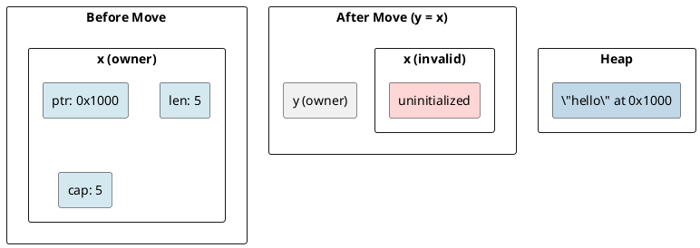
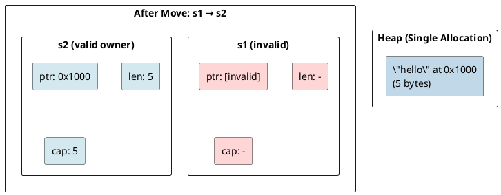
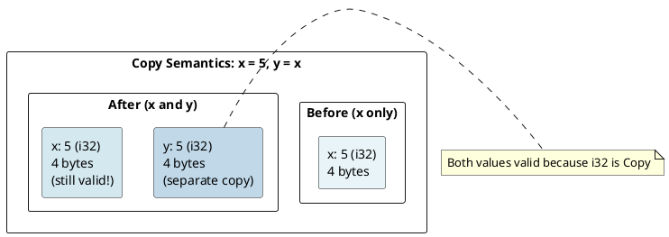
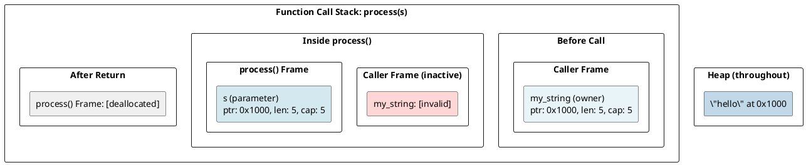
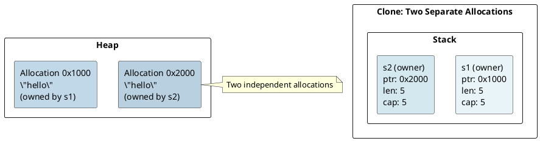
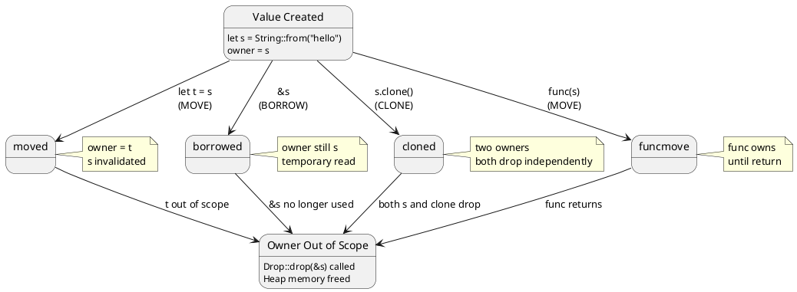

# Rust Memory Management: Ownership Under the Hood

## Overview
Rust's memory safety guarantees come from a **ownership system** enforced at compile-time. No garbage collector, no manual `malloc`/`free`—just three simple rules that prevent entire classes of bugs.

---

## 1. The Three Ownership Rules

### Rule 1: Every Value Has One Owner
```rust
let x = String::from("hello");  // x owns the String
let y = x;                      // ownership moves to y
// x is now invalid
```

**Memory state after `let y = x`:**



### Rule 2: Ownership is Transferred Via Assignment or Function Calls
```rust
fn consume(s: String) {  // takes ownership
    println!("{}", s);   // s is valid here
}  // s is dropped here

let s = String::from("hello");
consume(s);              // ownership moves into consume
// s is invalid here!
```

### Rule 3: When Owner Goes Out of Scope, the Value is Dropped
```rust
{
    let s = String::from("hello");  // s comes into scope
    // s is valid here
}  // s goes out of scope
   // Drop::drop(&s) is called automatically
   // Heap memory is freed
```

---

## 2. The Move Semantics

### What is a Move?
A **move** transfers ownership by copying the stack data (pointer/length/capacity) but NOT duplicating the heap allocation.

```rust
let s1 = String::from("hello");      // Create on heap
let s2 = s1;                          // Move: copy 24 bytes on stack
```

**Stack after move:**


### Why Not Just Copy?
If we allowed both `s1` and `s2` to point to the same heap memory:
```rust
let s1 = String::from("hello");
let s2 = s1;

drop(s1);  // Frees heap memory
drop(s2);  // Would free already-freed memory → Double-free bug!
```

The compiler prevents this by **invalidating the source** after a move.

---

## 3. Copy Semantics

### Copy Types Don't Move
```rust
let x = 5;      // i32 is Copy
let y = x;      // x is still valid!

println!("{}", x);  // OK
```

**Why?** Primitive types are `Copy`:
```rust
#[derive(Copy, Clone)]
pub struct MyInt(i32);  // Copies entire value when moved
```

When a type is `Copy`, assignment performs a **bitwise copy** instead of a move.

**Stack layout:**


---

## 4. The Drop Trait and RAII

### Automatic Cleanup via Drop
Every type can implement `Drop`:

```rust
impl Drop for String {
    fn drop(&mut self) {
        // Free heap memory
        // Called automatically when goes out of scope
    }
}
```

**The Rust Resource Acquisition Is Initialization (RAII) pattern:**
- **Acquire**: Constructor allocates resources
- **Use**: Resource available in scope
- **Release**: `Drop` called at scope exit

```rust
{
    let f = File::open("data.txt")?;  // Acquire file handle
    // Use file
}  // f.drop() called → file handle closed
   // No resource leak!
```

### Drop Order
For structs, fields are dropped **in reverse declaration order**:

```rust
struct Employee {
    name: String,      // Dropped last
    id: u64,           // Dropped first (Copy, no drop code)
}

let emp = Employee { 
    id: 42, 
    name: String::from("Alice") 
};
// Dropping emp:
// 1. name.drop() → heap freed
// 2. id.drop() → no-op (i64 is Copy)
```

---

## 5. References and Borrowing (Quick Intro)

### Immutable References (`&T`)
```rust
let s1 = String::from("hello");
let s2 = &s1;  // Borrow: no ownership transfer

println!("{}", s1);  // s1 still valid!
println!("{}", s2);  // s2 is a reference to s1
```

**Memory:**
```
s1 owns:
┌─────────────────┐
│ ptr: 0x1000     │ ──┐
│ len: 5          │   │
│ cap: 5          │   │
└─────────────────┘   │
                      │
s2 borrows:           │
┌─────────────────┐   │
│ ref ptr: &s1    │ ──┤ (points to s1, not the heap directly)
└─────────────────┘   │
                      │
Heap:                 │
┌─────────────────┐   │
│ "hello"         │ ◄─┘
└─────────────────┘
```

→ See [Borrowing & References](04-borrowing-references.md) for details.

---

## 6. Heap Allocation with Box<T>

### Boxing Values
```rust
let x = Box::new(42);  // Allocate 42 on heap
```

**Memory layout:**
```
Stack:
┌─────────────────┐
│ x (Box<i32>)    │
│ ptr: 0x1000     │ ──┐
├─────────────────┤   │
                      │
Heap:                 │
┌────────┐            │
│ 42     │ ◄──────────┘
└────────┘
```

When `x` goes out of scope:
1. `Drop::drop(x)` is called
2. Heap memory is freed
3. The pointer is invalidated

**Box size:** 8 bytes (just a pointer on 64-bit systems).

---

## 7. Move Semantics in Function Calls

### Function Takes Ownership
```rust
fn process(s: String) {  // Takes ownership
    println!("{}", s);
}  // s is dropped here

let my_string = String::from("hello");
process(my_string);  // Ownership moves in
// my_string is now invalid!
process(my_string);  // ERROR: value used after move
```

**Call stack:**


### Return Transfers Ownership Back
```rust
fn make_string() -> String {
    let s = String::from("hello");
    s  // Ownership moves out
}  // s is NOT dropped here (moved)

let s = make_string();  // Receive ownership
```

---

## 8. Clone: Explicit Deep Copy

### When You Need a Real Copy
```rust
let s1 = String::from("hello");
let s2 = s1.clone();  // Explicit deep copy

println!("{}", s1);  // OK, s1 still owns original
println!("{}", s2);  // OK, s2 owns the copy
```

**Memory after clone:**


**Performance implication:** `clone()` is expensive for large strings! Only use when you actually need two copies.

---

## 9. Memory Leaks (Possible but Rare)

### Can You Leak Memory in Rust?
**Technically yes**, but it's hard:

```rust
use std::mem::forget;

let s = String::from("hello");
forget(s);  // Memory leaked! (requires explicit `forget`)
            // The compiler won't clean up s
```

Or with circular references:
```rust
use std::rc::Rc;
use std::cell::RefCell;

let a = Rc::new(RefCell::new(5));
let b = Rc::clone(&a);

// Create cycle: a → b, b → a
// Reference count never reaches 0 → memory leaked
```

**Why Rust allows this:** Memory safety ≠ memory leak prevention. Rust prevents **use-after-free** and **double-free**, but can't prevent all logical leaks.

→ See [Smart Pointers](11-smart-pointers.md) for solutions like `Weak<T>`.

---

## 10. Performance: Move vs Copy vs Clone

```rust
// Move: O(1) - just copy pointer/len/cap
let s1 = String::from("hello");
let s2 = s1;  // Cheap!

// Copy: O(1) - copy entire value
let x = 42i32;
let y = x;  // Cheap! (4 bytes)

// Clone: O(n) - allocate + copy data
let s1 = String::from("hello");
let s2 = s1.clone();  // Expensive! (allocates new buffer)
```

**Rule of thumb:**
- Use **move** (default for non-Copy types)
- Use **Copy** only for small, simple types
- Use **clone** only when you need a real copy

---

## 11. Example: Building a String

```rust
fn build_message() {
    let s1 = String::from("hello");           // Allocate: "hello"
    let s2 = String::from(" ");               // Allocate: " "
    let s3 = String::from("world");           // Allocate: "world"
    
    let mut result = s1;                      // Move: s1 → result
    result.push_str(&s2);                     // Borrow s2, append
    result.push_str(&s3);                     // Borrow s3, append
    
    println!("{}", result);                   // "hello world"
}   // All strings dropped here in reverse order
    // Heap memory freed automatically
```

**Stack evolution:**
1. s1, s2, s3 allocated (3 strings)
2. result = s1 (s1 invalidated, result is new owner)
3. s2 borrowed for append
4. s3 borrowed for append
5. scope exit → result, s2, s3 dropped

---

## Summary Diagram



---

## Key Takeaways

| Concept | Meaning | Performance |
|---------|---------|-------------|
| **Move** | Transfer ownership, invalidate source | O(1) - copy pointer |
| **Copy** | Bitwise duplication, both valid | O(1) - small values |
| **Clone** | Deep copy with new allocation | O(n) - expensive |
| **Borrow** | Temporary reference, owner unchanged | O(1) - just pointer |
| **Drop** | Automatic cleanup at scope exit | Depends on type |

---

**Next:** [Borrowing & References →](04-borrowing-references.md) Learn the borrow checker rules.
