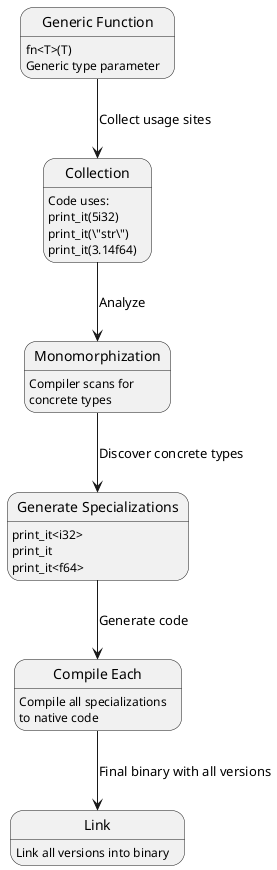
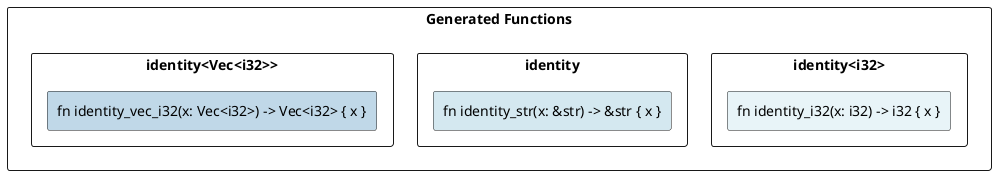
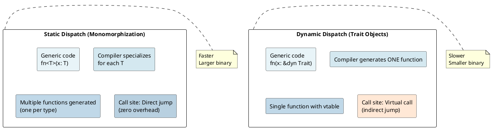
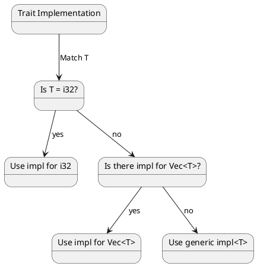
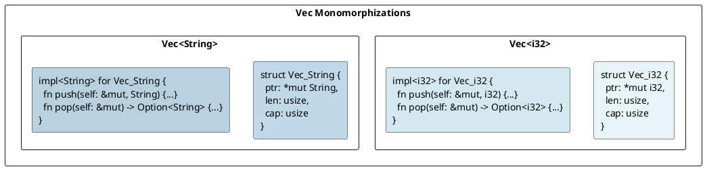

# Generics & Monomorphization: Under the Hood

## Overview
**Monomorphization** is the process where Rust's compiler generates **specialized versions** of generic code for each concrete type. This enables zero-cost abstractions while maintaining type safety.

---

## 1. What is Monomorphization?

### Generic Code to Specialized Code
```rust
fn print_it<T: std::fmt::Debug>(val: T) {
    println!("{:?}", val);
}

print_it(5i32);
print_it("hello");
print_it(3.14f64);
```

**At compile time, Rust generates:**

```rust
// Specialized for i32
fn print_it_i32(val: i32) {
    println!("{:?}", val);
}

// Specialized for &str
fn print_it_str(val: &str) {
    println!("{:?}", val);
}

// Specialized for f64
fn print_it_f64(val: f64) {
    println!("{:?}", val);
}

print_it_i32(5);
print_it_str("hello");
print_it_f64(3.14);
```

**Result:** No runtime overhead—each call is **direct**, not through dynamic dispatch.

---

## 2. The Monomorphization Process



---

## 3. Generic Functions

### Example: Identity Function
```rust
fn identity<T>(x: T) -> T {
    x
}

let a = identity(42);           // i32
let b = identity("hello");      // &str
let c = identity(vec![1, 2]);   // Vec<i32>
```

**Monomorphized:**



---

## 4. Generic Structs

### Struct Monomorphization
```rust
struct Pair<T> {
    first: T,
    second: T,
}

let pair_i32 = Pair { first: 1, second: 2 };
let pair_str = Pair { first: "a", second: "b" };
```

**Compiler generates:**

```rust
// For i32
struct Pair_i32 {
    first: i32,
    second: i32,
}

// For &str
struct Pair_str {
    first: &str,
    second: &str,
}

// For String
struct Pair_String {
    first: String,
    second: String,
}
```

**Memory layouts differ:**
- `Pair<i32>`: 8 bytes
- `Pair<&str>`: 16 bytes (2 pointers + 2 lengths)
- `Pair<String>`: 48 bytes (2 Strings, each 24 bytes)

---

## 5. Generic Methods

### Impl Blocks and Monomorphization
```rust
impl<T> Pair<T> {
    fn new(first: T, second: T) -> Self {
        Pair { first, second }
    }

    fn first(&self) -> &T {
        &self.first
    }
}
```

**Monomorphized:**
```rust
impl Pair_i32 {
    fn new(first: i32, second: i32) -> Pair_i32 { ... }
    fn first(&self) -> &i32 { ... }
}

impl Pair_str {
    fn new(first: &str, second: &str) -> Pair_str { ... }
    fn first(&self) -> &&str { ... }
}
```

Each monomorphized type gets **its own method implementations**.

---

## 6. Trait Bounds and Monomorphization

### Static Dispatch (Monomorphized)
```rust
fn print_it<T: std::fmt::Debug>(x: T) {
    println!("{:?}", x);
}

print_it(5);        // Generate: print_it<i32>
print_it("hello");  // Generate: print_it<&str>
```

**Result:** Two functions generated, each specialized.

### Dynamic Dispatch (Not Monomorphized)
```rust
fn print_it(x: &dyn std::fmt::Debug) {
    println!("{:?}", x);
}

print_it(&5);        // No specialization—virtual call
print_it(&"hello");  // No specialization—virtual call
```

**Result:** One function generated, uses virtual function calls.

→ See [Trait Objects](15-trait-objects.md) for details.

---

## 7. Generic Instantiation Sites

### Code Bloat: Monomorphization Explosion
```rust
fn generic_swap<T>(a: &mut T, b: &mut T) {
    std::mem::swap(a, b);
}

// Used in thousands of places:
generic_swap(&mut x_i32, &mut y_i32);
generic_swap(&mut x_String, &mut y_String);
generic_swap(&mut x_Vec, &mut y_Vec);
// ... hundreds more types ...
```

**Result:** Each usage generates new code.

**Trade-off:**
- ✅ **Benefit:** Zero runtime overhead, specialization optimizations
- ❌ **Cost:** Larger binary size ("code bloat")

### Mitigation Strategies
```rust
// Strategy 1: Move generic logic to non-generic function
fn swap_generic<T>(a: &mut T, b: &mut T) {
    unsafe { std::ptr::swap(a, b); }
}

// Strategy 2: Share code via references (dynamic dispatch)
fn swap_dyn(a: &mut dyn Any, b: &mut dyn Any) {
    // Slower, but single implementation
}

// Strategy 3: Only monomorphize public API
pub fn public_api<T: Serialize>(x: T) {
    internal_generic(x)  // Called by public API
}
```

---

## 8. Monomorphization vs Dynamic Dispatch



---

## 9. Type Parameter Defaults

### Generic with Default Types
```rust
struct Result<T, E = String> {
    value: T,
    error: E,
}

Result<i32>              // E defaults to String
Result<i32, String>      // Explicit E
Result<i32, Box<dyn std::error::Error>>
```

Each combination is monomorphized separately.

---

## 10. Const Generics

### Const Type Parameters
```rust
struct Array<T, const N: usize> {
    data: [T; N],
}

let arr1: Array<i32, 5> = Array { data: [0; 5] };
let arr2: Array<i32, 10> = Array { data: [0; 10] };
```

**Monomorphization:**
```
Array<i32, 5>    → separate type
Array<i32, 10>   → different type
Array<i32, 100>  → yet another type
```

Each const value generates **new specialization**.

⚠️ **Warning:** Const generics can cause code explosion!

---

## 11. Where Bounds and Specialization

### Specialization Rules
```rust
// General implementation
impl<T> MyTrait for T {}

// Specialized implementation (more specific)
impl MyTrait for i32 {}

// Rust chooses the most specific one
let x: i32 = ...;
// Uses specialized impl for i32, not generic impl
```

**Compiler selection:**



---

## 12. Compilation Time Impact

### Monomorphization Increases Compile Time
Generating specialized code for each type takes time:

```
Compile time = parsing + analysis + monomorphization + codegen + linking

More generic usage = More monomorphizations = Longer compile time
```

### Strategies to Reduce Compile Time

```rust
// ❌ SLOW: Monomorphize everything
pub fn process<T: Serialize>(x: T) {
    let json = serde_json::to_string(&x).unwrap();
    println!("{}", json);
}

// ✅ FAST: Use dynamic dispatch for implementation
pub fn process<T: Serialize>(x: T) {
    process_internal(&x as &dyn erased_serde::Serialize);
}

fn process_internal(x: &dyn erased_serde::Serialize) {
    let json = serde_json::to_string(x).unwrap();
    println!("{}", json);
}
```

---

## 13. Example: Vec<T> Monomorphization

```rust
let v1: Vec<i32> = vec![1, 2, 3];
let v2: Vec<String> = vec!["a".to_string()];
```

**Monomorphized:**



---

## 14. Key Takeaways

| Aspect | Details |
|--------|---------|
| **Monomorphization** | Compile-time specialization for each concrete type |
| **Static Dispatch** | Direct function calls, zero runtime overhead |
| **Binary Size** | Increases with more monomorphizations |
| **Compile Time** | Increases with more monomorphizations |
| **Optimization** | Each specialization can be optimized independently |
| **vs Dynamic Dispatch** | Faster (static) vs smaller binaries (dynamic) |

---

## 15. Compiler Flags

### Check Monomorphization
```bash
# See monomorphization instances
cargo +nightly -Z print-mono-items build 2>&1 | head -20

# Profile compilation
cargo build -Z timings

# Analyze binary size
cargo bloat --release
```

---

**Next:** [Trait System →](10-traits.md) Learn virtual tables and dynamic dispatch.
