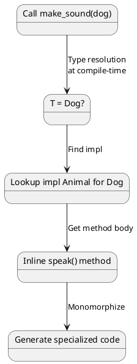
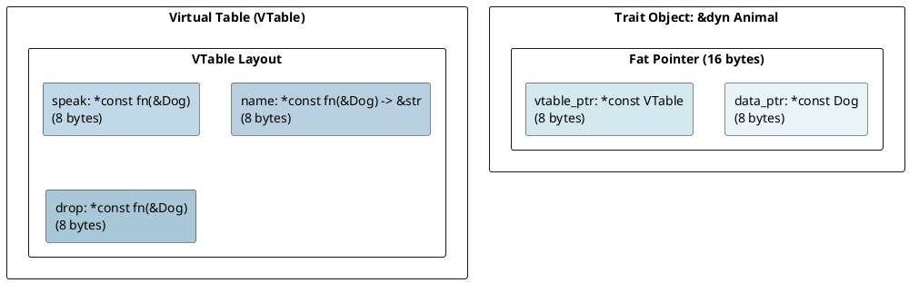
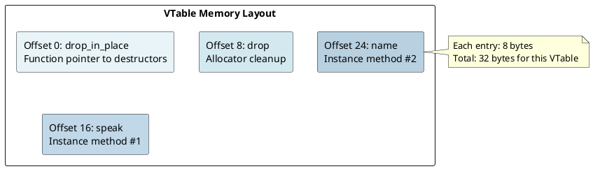
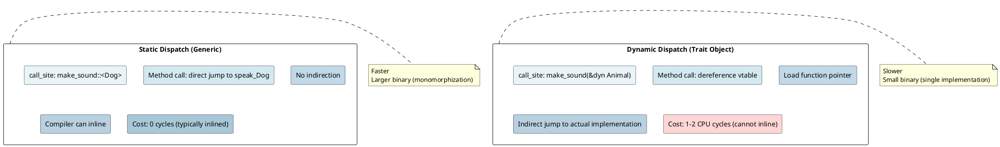

# Trait System: Virtual Tables and Dispatch Under the Hood

## Overview
Traits are Rust's answer to polymorphism. Understanding **static vs dynamic dispatch** and **virtual tables** is key to knowing when Rust code is zero-cost and when there's overhead.

---

## 1. What is a Trait?

### Trait Definition
```rust
trait Animal {
    fn speak(&self);
    fn name(&self) -> &str;
}

struct Dog {
    name: String,
}

impl Animal for Dog {
    fn speak(&self) {
        println!("Woof!");
    }

    fn name(&self) -> &str {
        &self.name
    }
}
```

**Compiler perspective:**
- Trait is a **contract** specifying methods
- Impl block provides concrete implementation for type
- Different types can implement same trait

---

## 2. Static Dispatch (Monomorphization)

### Generic Trait Bounds
```rust
fn make_sound<A: Animal>(animal: A) {
    animal.speak();
}

let dog = Dog { name: "Rex".to_string() };
make_sound(dog);  // Monomorphizes: make_sound::<Dog>
```

**Compilation:**
```rust
// Compiler generates:
fn make_sound_Dog(animal: Dog) {
    Animal::speak(&animal);  // Direct call
}

make_sound_Dog(dog);
```

**Method call resolution (static dispatch):**



**Result:** Direct method call, **zero runtime overhead**.

---

## 3. Dynamic Dispatch (Trait Objects)

### Trait Objects (`dyn Trait`)
```rust
fn make_sound(animal: &dyn Animal) {
    animal.speak();
}

let dog = Dog { name: "Rex".to_string() };
make_sound(&dog);  // No monomorphization!
```

**Representation:** A **fat pointer** containing:
1. **Data pointer** - points to actual object
2. **Virtual table pointer** - points to vtable



### Method Call Through VTable
```rust
let animal: &dyn Animal = &dog;
animal.speak();
```

**Runtime execution:**
```
1. Extract vtable_ptr from fat pointer
2. Look up speak method in vtable
3. Load function pointer
4. Call function: speak(data_ptr)
```

**Result:** Indirect method call with **vtable lookup overhead** (~1-2 CPU cycles).

---

## 4. VTable Structure

### Typical VTable Layout
```rust
struct VTableForDogAsAnimal {
    drop_in_place: fn(*mut Dog),
    drop: fn(&Dog),
    speak: fn(&Dog),
    name: fn(&Dog) -> &str,
}
```

**Memory:**



---

## 5. Static vs Dynamic Dispatch Comparison

### Performance Trade-off



---

## 6. When to Use Each

### Static Dispatch (`fn<T: Trait>`)
**Use when:**
- Performance is critical
- Type is known at compile-time
- You can afford binary size increase

```rust
fn process<T: Debug>(item: T) {  // Generic → static dispatch
    println!("{:?}", item);
}

process(42);        // Specialized version generated
process("hello");   // Different specialized version
```

### Dynamic Dispatch (`&dyn Trait`)
**Use when:**
- You need runtime polymorphism
- Binary size matters
- Type is truly unknown at compile-time

```rust
fn process(item: &dyn Debug) {  // Trait object → dynamic dispatch
    println!("{:?}", item);
}

let items: Vec<&dyn Debug> = vec![&42, &"hello"];  // Mixed types!
for item in items {
    process(item);
}
```

---

## 7. Trait Objects and Fat Pointers

### Fat Pointer Details
```rust
let dog = Dog { name: "Rex".to_string() };
let animal: &dyn Animal = &dog;

// Layout:
// animal.data_ptr → points to dog instance
// animal.vtable_ptr → points to VTable for Dog impl of Animal
```

### Size of Trait Objects
```rust
println!("{}", std::mem::size_of::<&dyn Animal>());  // 16 (fat pointer)
println!("{}", std::mem::size_of::<Box<dyn Animal>>());  // 16
println!("{}", std::mem::size_of::<Rc<dyn Animal>>());   // 16
```

All trait objects are **16 bytes on 64-bit systems** (two 8-byte pointers).

---

## 8. Object Safety

### What is Object-Safe?
A trait is **object-safe** if it can be used as a trait object (`&dyn Trait`).

```rust
// Object-safe trait ✓
trait Drawable {
    fn draw(&self);
}

// NOT object-safe ✗
trait Sized {
    fn size_of_self() -> usize;  // No &self → cannot be called on dyn
}

trait GenericTrait<T> {  // Generic type param → not object-safe
    fn process(&self, item: T);
}
```

**Why?** At runtime, the actual type is erased. The vtable cannot work with:
- Methods taking `Self` by value (size unknown)
- Generic type parameters (too specific)
- Class methods with no receiver

```rust
// ✓ Object-safe methods:
fn take_ref(&self);
fn take_mut(&mut self);
fn boxed(self: Box<self>);

// ✗ NOT object-safe:
fn takes_self(self);           // No size info
fn generic<T>(&self, t: T);    // Generic type unknown
```

---

## 9. Trait Bounds and Coherence

### Coherence Rule
At most one impl per type:

```rust
trait Drawable {
    fn draw(&self);
}

impl Drawable for String { /* A */ }
impl Drawable for String { /* B */ }  // ERROR: conflicting implementations
```

Rust enforces **coherence**: given a type, there's exactly one applicable impl.

### Overlapping Impls Prevention
```rust
// OK: impl for concrete type
impl Drawable for String { }

// OK: impl for generic (doesn't overlap if specific impl exists)
impl<T> Drawable for Vec<T> { }

// ERROR: Overlapping
impl<T: Debug> Drawable for T { }          // Too broad!
impl<T: Clone> Drawable for T { }          // Conflicts!
```

---

## 10. Associated Types

### Traits with Associated Types
```rust
trait Container {
    type Item;  // Associated type (filled in by impl)

    fn contains(&self, item: Self::Item) -> bool;
}

impl Container for Vec<String> {
    type Item = String;  // Concrete type

    fn contains(&self, item: String) -> bool {
        self.iter().any(|s| s == &item)
    }
}
```

**Advantage:** More flexible than generic type parameters.

```rust
// Generic type param version (less clear):
trait Container<T> {
    fn contains(&self, item: T) -> bool;
}

// Associated type version (clearer intent):
trait Container {
    type Item;
    fn contains(&self, item: Self::Item) -> bool;
}
```

---

## 11. Trait Objects with Associated Types

### Problem: Associated Types and Object Safety
```rust
trait Container {
    type Item;
    fn contains(&self, item: Self::Item) -> bool;
}

let v: Vec<Box<dyn Container>> = vec![];  // ERROR!
// Why? Item type is not known at runtime!
```

**Solution:** Specify associated type

```rust
trait ContainerString: Container<Item = String> {}

let v: Vec<Box<dyn ContainerString>> = vec![];  // OK
```

---

## 12. VTable Optimization

### Inline VTables (Usually)
```rust
let dog = Dog { name: "Rex".to_string() };
let animal: &dyn Animal = &dog;
```

The VTable is typically **emitted once per type** in the binary (not duplicated).

### Zero-Sized Impls
```rust
trait Empty {}

println!("{}", std::mem::size_of::<&dyn Empty>());  // 16 (fat pointer)
// Even though Empty has no methods!
```

The vtable still exists for `drop` and layout info.

---

## 13. Performance Example

### Benchmarking Static vs Dynamic

```rust
// Static (inlined, fast)
fn static_call(animals: &[Dog; 1000]) {
    for dog in animals {
        dog.speak();  // Inlined
    }
}

// Dynamic (vtable lookups, slow)
fn dynamic_call(animals: &[&dyn Animal]) {
    for animal in animals {
        animal.speak();  // vtable lookup + indirect call
    }
}
```

**Performance ratio:** Typically 1-5% overhead for dynamic dispatch (modern CPUs, good branch prediction).

---

## 14. Multiple Trait Bounds

### Combining Traits
```rust
fn process<T: Display + Debug + Clone>(item: T) {
    println!("{:?}", item);  // requires Debug
    println!("{}", item);     // requires Display
    let copy = item.clone();  // requires Clone
}
```

Type must satisfy **all** bounds simultaneously.

### Trait Object with Multiple Traits
```rust
let item: &(dyn Display + Debug) = &42;
```

Multiple vtables are generated (one per trait).

---

## 15. Common Patterns

### Sealed Trait Pattern
```rust
pub trait Public {
    fn public_method(&self);
}

mod private {
    pub trait Sealed {}  // Not exported
}

impl<T: private::Sealed> Public for T {
    fn public_method(&self) { }
}
```

Only types implementing `Sealed` can implement `Public`.

---

## Summary Table

| Feature | Static | Dynamic |
|---------|--------|---------|
| **Declaration** | `fn<T: Trait>` | `fn(&dyn Trait)` |
| **Binary Size** | Large (monomorphized) | Small (single impl) |
| **Performance** | Fast (direct call) | Slower (vtable) |
| **Inlining** | Yes | No |
| **Type Erasure** | No | Yes |
| **Fat Pointer** | No | Yes (16 bytes) |

---

**Next:** [Smart Pointers →](11-smart-pointers.md) Learn Box, Rc, Arc, and Weak.
