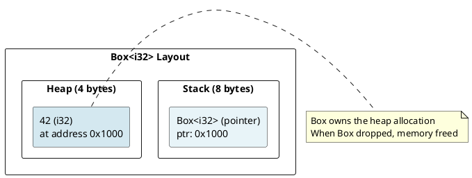
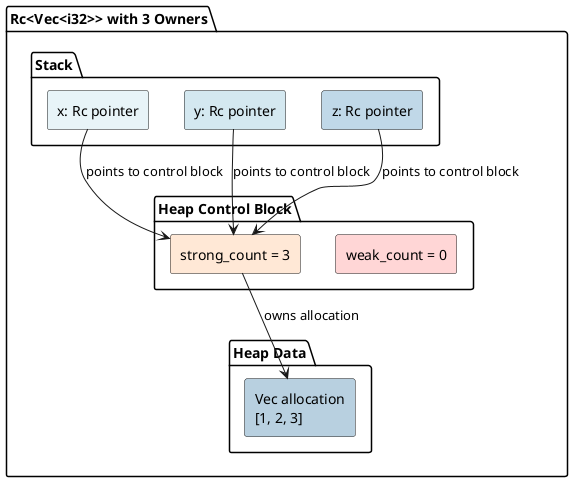
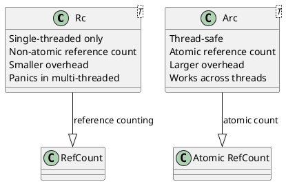
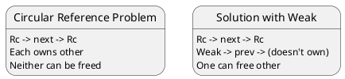
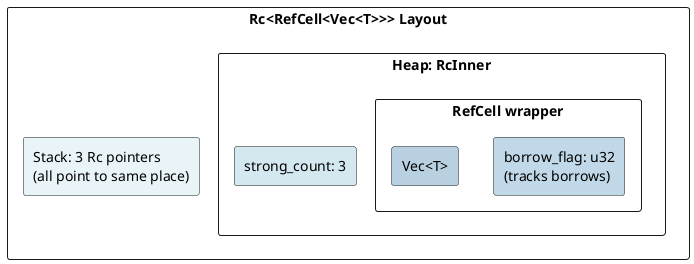
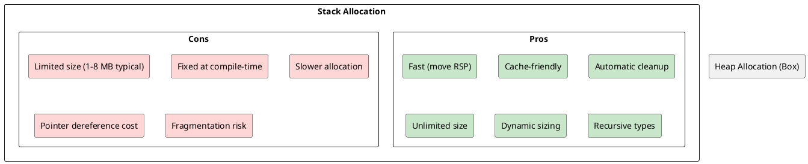

# Smart Pointers: Box, Rc, Arc, Weak Under the Hood

## Overview
Smart pointers are abstractions that own and manage heap memory. Each provides different semantics: exclusive ownership (Box), reference counting (Rc/Arc), and weak references (Weak).

---

## 1. Box<T>: Exclusive Heap Allocation

### What is Box?
Box is the simplest smart pointer: **allocates on heap, one owner**.

```rust
let b = Box::new(42);  // Allocate i32 on heap
println!("{}", b);     // Dereference implicitly
```

### Box Memory Layout



### Box = Simplified Ownership
```rust
let x = 42;
let b = Box::new(x);  // Move 42 to heap
drop(b);              // Calls drop on Box
                      // Box deallocates heap memory
// x is still valid on stack
```

### Box Size
```rust
println!("{}", std::mem::size_of::<Box<i32>>());      // 8 (just pointer)
println!("{}", std::mem::size_of::<Box<String>>());   // 8 (just pointer)
```

**Important:** Box itself is tiny (8 bytes on 64-bit). The data is on the heap.

---

## 2. Rc<T>: Reference Counting (Single-Threaded)

### Shared Ownership
```rust
use std::rc::Rc;

let x = Rc::new(vec![1, 2, 3]);  // Create rc'd vector
let y = Rc::clone(&x);            // Increment reference count
let z = Rc::clone(&x);            // Increment again

// x, y, z all point to same vector
// Vector freed when ALL rc's are dropped
```

### Reference Count Mechanism



### Rc Drop Behavior
```rust
{
    let x = Rc::new(42);  // count = 1
    {
        let y = Rc::clone(&x);  // count = 2
        // y dropped: count = 2 → 1
    }
    // x dropped: count = 1 → 0
    // Memory freed!
}
```

### Rc Memory Layout
```rust
let rc = Rc::new(42);

println!("{}", std::mem::size_of_val(&rc));  // 8 (pointer to control block)
// Control block contains: strong_count, weak_count, data (42)
```

---

## 3. Arc<T>: Atomic Reference Counting (Thread-Safe)

### Shared Ownership Across Threads
```rust
use std::sync::Arc;
use std::thread;

let data = Arc::new(vec![1, 2, 3]);

for i in 0..3 {
    let data_clone = Arc::clone(&data);
    thread::spawn(move || {
        println!("{:?}", data_clone);
    });
}
// All threads share same vector
// Vector freed when last thread finishes
```

### Arc vs Rc



### Arc Implementation Detail
```rust
// Simplified internal structure
pub struct Arc<T> {
    ptr: *const ArcInner<T>,
}

struct ArcInner<T> {
    strong: AtomicUsize,    // Atomic for thread-safety
    weak: AtomicUsize,
    data: T,
}
```

The reference count uses **AtomicUsize** (atomic operation) for thread-safe increment/decrement.

---

## 4. Weak<T>: Non-Owning References

### Preventing Circular References
```rust
use std::rc::Rc;
use std::cell::RefCell;

struct Node {
    value: i32,
    next: Option<Rc<Node>>,
    prev: Option<Weak<Node>>,  // Weak to prevent cycle
}

// Forward link: Rc (owns next node)
// Backward link: Weak (does NOT own previous node)
// When prev drops, node stays alive if someone owns it
```

### Weak<T> Behavior



### Weak Reference Count
```
struct ArcInner<T> {
    strong: AtomicUsize,  // Rc/Arc references
    weak: AtomicUsize,    // Weak references
    data: T,
}

// Data freed when: strong_count == 0
// Control block freed when: strong_count == 0 AND weak_count == 0
```

### Using Weak<T>
```rust
let rc = Rc::new(42);
let weak = Rc::downgrade(&rc);  // Create weak ref

if let Some(strong) = weak.upgrade() {
    println!("{}", strong);  // Can use it
} else {
    println!("Value was dropped");
}
```

---

## 5. Performance: Box vs Stack

### Stack vs Heap Allocation
```rust
// Stack allocation (fast, small)
let x = 42i32;
let y = x;  // Copy

// Heap allocation (slower, large)
let b = Box::new(vec![1, 2, 3, 4, 5]);
let c = Box::clone(&b);  // Different pointer, same data
```

### Benchmark Conceptually
```
Stack: Allocation = move RSP (1 cycle)
Heap: Allocation = malloc/new (100+ cycles) + initialization
```

**Use Box when:**
- Type is too large for stack
- Need dynamic sizing
- Recursive types (must have indirection)

---

## 6. Interior Mutability with RefCell<T>

### Combining Rc and RefCell
```rust
use std::rc::Rc;
use std::cell::RefCell;

let data = Rc::new(RefCell::new(vec![1, 2, 3]));
let clone1 = Rc::clone(&data);
let clone2 = Rc::clone(&data);

clone1.borrow_mut().push(4);
clone2.borrow_mut().push(5);

println!("{:?}", data.borrow());  // [1, 2, 3, 4, 5]
```

### Layout with RefCell



---

## 7. Smart Pointer Sizes

```rust
println!("{}", std::mem::size_of::<Box<i32>>());           // 8
println!("{}", std::mem::size_of::<Rc<i32>>());            // 8
println!("{}", std::mem::size_of::<Arc<i32>>());           // 8
println!("{}", std::mem::size_of::<Weak<i32>>());          // 8

println!("{}", std::mem::size_of::<Option<Box<i32>>>());   // 8
println!("{}", std::mem::size_of::<Option<Rc<i32>>>());    // 8 (null = None)
```

All smart pointers are **8 bytes on 64-bit systems** (just a pointer).

---

## 8. Deref and Deref Coercion

### Deref Trait
```rust
impl<T> Deref for Box<T> {
    type Target = T;

    fn deref(&self) -> &T {
        &**self  // Double deref: *self (unbox) -> *T (pointer)
    }
}

let b = Box::new(42);
println!("{}", *b);      // Explicit deref
println!("{}", b.field); // Deref coercion (automatic)
```

### Deref Coercion Examples
```rust
let b: Box<String> = Box::new("hello".to_string());

// These all work (deref coercion):
let len = b.len();              // Box<String> → String → str
let slice: &str = &*b;          // Explicit deref
let slice: &str = &b;           // Deref coercion
```

---

## 9. Stack Versus Heap: When to Use Each



---

## 10. Common Patterns

### Builder Pattern with Box
```rust
struct Builder {
    data: Option<Box<Data>>,
}

impl Builder {
    fn build(self) -> Result<Data, Error> {
        self.data.ok_or(Error::Missing)
    }
}
```

### Trait Objects
```rust
let items: Vec<Box<dyn Trait>> = vec![
    Box::new(TypeA {}),
    Box::new(TypeB {}),
];
```

---

## 11. Reference Counting Graph

```
When reference count reaches 0:

Rc<T>/Arc<T> lifecycle:
  new()           → count = 1
  clone()         → count ++
  drop(clone)     → count --
  drop(last)      → count = 0 → deallocate memory

Multiple references = Multiple owners
Last owner dropping = Memory freed
```

---

## 12. Key Takeaways

| Pointer | Ownership | Thread-Safe | Overhead | Use Case |
|---------|-----------|------------|----------|----------|
| **Box** | Exclusive | N/A | 8 bytes | Heap allocation, dynamic sizing |
| **Rc** | Shared (single-thread) | No | 16+ bytes | Reference counting (single-thread) |
| **Arc** | Shared (multi-thread) | Yes | 24+ bytes | Reference counting (multi-thread) |
| **Weak** | Non-owning | Via Arc | 8 bytes | Break circular refs, weak refs |

---

**Next:** [Interior Mutability →](12-interior-mutability.md) Cell, RefCell, Mutex explained.
