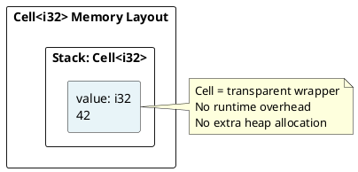
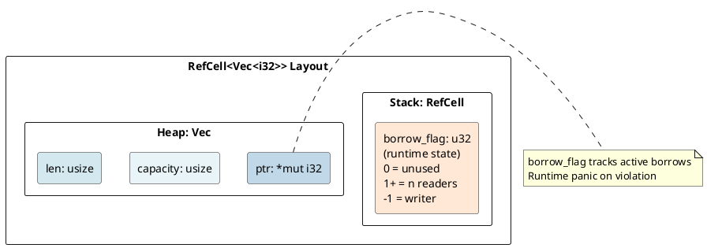
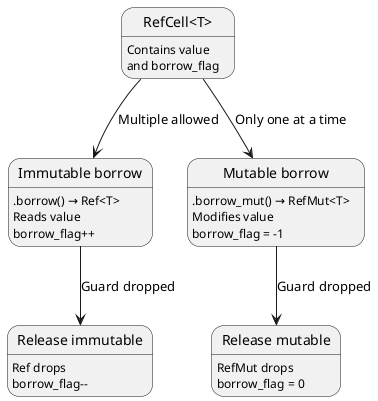
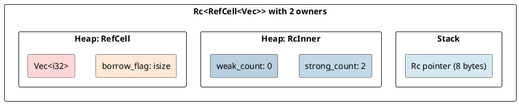
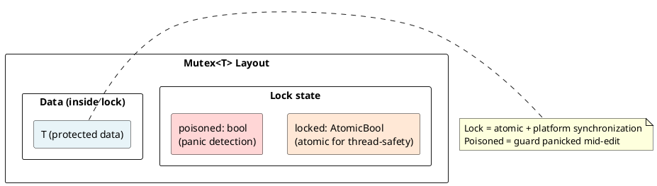
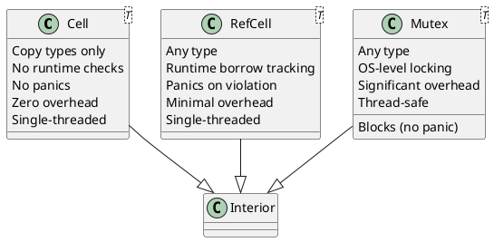

# Interior Mutability: Cell, RefCell, Mutex Under the Hood

## Overview
**Interior mutability** is a pattern to allow mutation through immutable references. Rust's borrow checker operates at compile-time; interior mutability shifts some checks to runtime. Three main implementations: Cell<T> (for Copy types), RefCell<T> (single-threaded), and Mutex<T> (thread-safe).

---

## 1. The Core Problem

### Compile-Time Limitation
```rust
struct Person {
    name: String,
    age: u32,
}

impl Person {
    // Cannot write this (compiler error: requires &mut self)
    fn have_birthday(&self) {
        self.age += 1;  // ERROR: cannot assign through immutable reference
    }
}
```

**Borrow checker says:** "You have `&self` (immutable), so you can't mutate!"

### Interior Mutability Solution
```rust
struct Person {
    name: String,
    age: Cell<u32>,  // Wrapped in Cell
}

impl Person {
    fn have_birthday(&self) {  // Still &self!
        // Cell allows mutation through &
        self.age.set(self.age.get() + 1);
    }
}
```

---

## 2. Cell<T>: Static Checking via Copy

### How Cell Works
```rust
use std::cell::Cell;

let x = Cell::new(42);
x.set(100);           // Mutable through &
let val = x.get();    // 100 (Copy trait required!)

println!("{}", val);  // 100
```

### Cell Layout



### Cell Size
```rust
println!("{}", std::mem::size_of::<Cell<i32>>());    // 4 (same as i32)
println!("{}", std::mem::size_of::<Cell<String>>()); // ERROR: String not Copy!
```

**Cell restriction:** Only `Copy` types (primitives, small copyable structs).

### Cell Interior Mutability Pattern
```rust
// Allowed: Cell shares mutability
x.set(value);          // Mutable operation
let val = x.get();     // Immutable operation

// NO borrow_mut() / borrow()
// NO runtime checks
// Copy requirement = no references into data
```

---

## 3. RefCell<T>: Runtime Checking

### Problem Solved by RefCell
```rust
struct Node {
    value: i32,
    next: Option<Box<Node>>,
}

// Need mutable access to node inside Box through shared ref
// Cell<Option<Box<Node>>> won't work (Option not Copy)
// Solution: RefCell<Option<Box<Node>>>
```

### RefCell Usage
```rust
use std::cell::RefCell;

let x = RefCell::new(vec![1, 2, 3]);

// Immutable borrow
let borrow = x.borrow();
println!("{:?}", *borrow);

// Mutable borrow
let mut borrow_mut = x.borrow_mut();
borrow_mut.push(4);
drop(borrow_mut);  // Release mutable borrow

// Can borrow again
let borrow2 = x.borrow();
println!("{:?}", *borrow2);  // [1, 2, 3, 4]
```

### RefCell Memory Layout



### Borrow Flag Encoding

```rust
// Internal representation (simplified)
type BorrowFlag = isize;

const UNUSED: isize = 0;          // No borrows
const WRITING: isize = -1;        // Currently being mutably borrowed
const READING: isize = 1;         // Reading (n readers = n)
```

---

## 4. RefCell::borrow() and borrow_mut()

### Borrow Guard Pattern

```rust
let x = RefCell::new(42);

{
    let borrow = x.borrow();       // Immutable borrow guard
    // borrow_flag incremented
    println!("{}", *borrow);       // Access via deref
    // At end of scope: borrow_flag decremented
}

{
    let mut borrow_mut = x.borrow_mut();  // Mutable borrow guard
    // borrow_flag set to WRITING
    *borrow_mut = 100;
    // At end of scope: borrow_flag set back to UNUSED
}
```

### Guard Lifetimes



---

## 5. Runtime Panic on Borrow Violation

### Detecting Conflicts at Runtime
```rust
let x = RefCell::new(42);

let borrow1 = x.borrow();      // borrow_flag = 1
let borrow2 = x.borrow();      // borrow_flag = 2 (OK)

// PANIC! Tried to mutably borrow while already borrowed
// let borrow_mut = x.borrow_mut();  // Would check: borrow_flag == 0? NO → PANIC
```

### Panic Detection
```rust
impl<T> RefCell<T> {
    pub fn borrow_mut(&self) -> RefMut<T> {
        match self.try_borrow_mut() {
            Ok(r) => r,
            Err(_) => panic!("already borrowed"),  // Runtime panic!
        }
    }

    pub fn try_borrow_mut(&self) -> Result<RefMut<T>, BorrowMutError> {
        if self.borrow_flag.get() != 0 {
            Err(BorrowMutError { /* ... */ })
        } else {
            self.borrow_flag.set(-1);
            Ok(RefMut { /* ... */ })
        }
    }
}
```

---

## 6. Rc<RefCell<T>>: Shared Mutable State

### Shared Mutability Pattern
```rust
use std::rc::Rc;
use std::cell::RefCell;

let data = Rc::new(RefCell::new(vec![1, 2, 3]));

let clone1 = Rc::clone(&data);
let clone2 = Rc::clone(&data);

clone1.borrow_mut().push(4);
clone2.borrow_mut().push(5);

println!("{:?}", data.borrow());  // [1, 2, 3, 4, 5]
```

### Memory Layout



---

## 7. Mutex<T>: Thread-Safe Interior Mutability

### Thread-Safe Variant
```rust
use std::sync::Mutex;
use std::thread;

let data = Mutex::new(0);

thread::scope(|s| {
    s.spawn(|| {
        let mut guard = data.lock().unwrap();
        *guard += 1;
    });
    s.spawn(|| {
        let mut guard = data.lock().unwrap();
        *guard += 1;
    });
});

println!("{}", *data.lock().unwrap());  // 2 (thread-safe!)
```

### Mutex Architecture



### Mutex Guard Pattern
```rust
{
    let guard = mutex.lock()?;  // Acquire lock
    // borrow_flag checked
    // OS acquires lock
    
    *guard = value;  // Modify protected data
    
    // Guard dropped → lock released
    // Platform semaphore notifies other threads
}
```

---

## 8. Differences: Cell vs RefCell vs Mutex



---

## 9. Performance Comparison

### Overhead

```
Operation            | Cell  | RefCell | Mutex
get/set (Copy)      | 1 ns  | 50 ns   | 100+ ns
borrow checking     | None  | 5 ns    | 100+ ns
Memory footprint    | Same  | +4 bytes| +16+ bytes
```

### When to Use

```
Cell<T>:
- Primitives that you'll only get/set
- Zero overhead needed
- Example: cache busting counters

RefCell<T>:
- Shared mutable state in single thread
- Can handle panics gracefully with try_borrow
- Example: Rc<RefCell<Node>> for graphs

Mutex<T>:
- Multi-threaded shared state
- Need blocking semantics
- Example: Arc<Mutex<T>> for thread-safe counters
```

---

## 10. Interior Mutability with Traits

### Using Cell in Trait Objects
```rust
trait Cache {
    fn get(&self, key: &str) -> Option<&Value>;
    fn set(&self, key: String, value: Value);  // &self!
}

struct MyCache {
    cache: Cell<HashMap<String, Value>>,
}

impl Cache for MyCache {
    fn get(&self, key: &str) -> Option<&Value> {
        self.cache.borrow().get(key)  // Borrow through &
    }

    fn set(&self, key: String, value: Value) {
        self.cache.borrow_mut().insert(key, value);
    }
}
```

---

## 11. Copy vs Clone Distinction

### Cell Only for Copy
```rust
// Works: String not Copy, but copied via getter
Cell::new("hello".to_string())

// Clone required to extract
let s = cell.borrow().clone();

// Won't compile: can't get reference to interior
let _ref: &String = ???;  // No way to get this safely!
```

**Why:** Interior mutability without Copy would allow:
1. Get `&T`
2. Mutate through separate `&mut T`
3. `&T` now pointing to modified data!

---

## 12. Real-World Examples

### Logger with Interior Mutability
```rust
use std::cell::RefCell;

struct Logger {
    messages: RefCell<Vec<String>>,
}

impl Logger {
    fn log(&self, msg: String) {
        // Can mutate through &self!
        self.messages.borrow_mut().push(msg);
    }
}
```

### Lazy Initialization
```rust
use std::cell::RefCell;

struct Lazy {
    value: RefCell<Option<ExpensiveValue>>,
}

impl Lazy {
    fn get(&self) -> &ExpensiveValue {
        let mut v = self.value.borrow_mut();
        if v.is_none() {
            *v = Some(expensive_computation());
        }
        // Unsound! Can't return &T while RefMut alive
    }
}
```

---

## 13. Key Takeaways

| Type | Overhead | Thread-Safe | Panic Risk | Use Case |
|------|----------|-------------|-----------|----------|
| **Cell** | None | No | No | Copyable caches |
| **RefCell** | Low | No | Yes | Shared mutable state (single-thread) |
| **Mutex** | High | Yes | No | Shared mutable state (multi-thread) |

---

**Next:** [Error Handling →](13-error-handling.md) Learn panic semantics and Result propagation.
