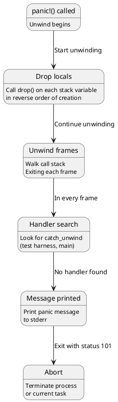
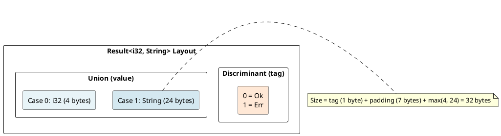
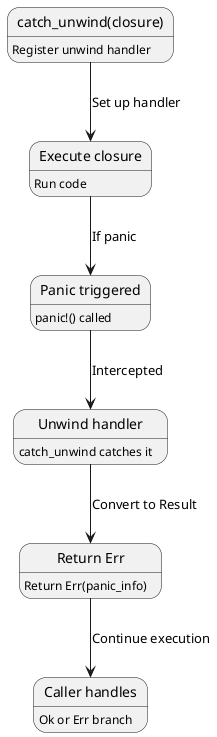
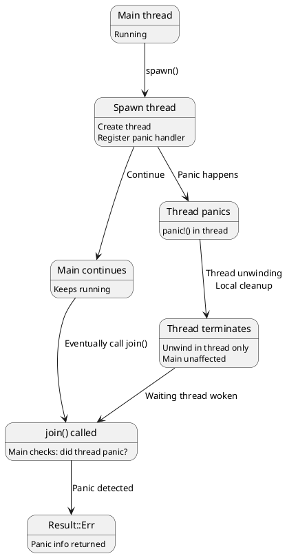
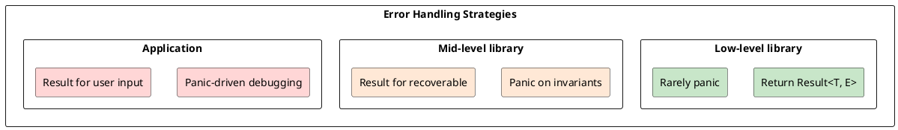

# Error Handling: Panic Semantics and Result Propagation

## Overview
Rust provides two error handling mechanisms: **panic** (unrecoverable, terminates task/thread) and **Result<T,E>** (recoverable, explicit handling). Understanding their under-the-hood implementation is key to writing robust code.

---

## 1. Panics: Unwind Mechanism

### What is a Panic?
```rust
panic!("Something went wrong!");  // Immediate abort

// Function that may panic:
fn divide(a: i32, b: i32) -> i32 {
    if b == 0 {
        panic!("Division by zero!");
    }
    a / b
}
```

### Panic Execution Flow



### Stack Unwinding Details
```rust
fn level3() {
    panic!("error!");  // Call panic
}

fn level2() {
    let x = vec![1, 2, 3];  // Allocated
    level3();               // Panics
    // Drop x (called during unwind)
}

fn level1() {
    let s = String::from("test");  // Allocated
    level2();
    // Drop s (called during unwind)
}

// Unwind sequence:
// 1. panic!() called in level3
// 2. level3 frame exits (no locals to drop)
// 3. level2 frame exits (drop x: vec freed)
// 4. level1 frame exits (drop s: string freed)
// 5. main frame exits (process terminates)
```

---

## 2. Result<T, E> Representation

### Result Enum
```rust
pub enum Result<T, E> {
    Ok(T),
    Err(E),
}
```

### Result Memory Layout



### Result Size
```rust
println!("{}", std::mem::size_of::<Result<i32, String>>());    // 32
println!("{}", std::mem::size_of::<Result<(), String>>());     // 24 (no Ok payload)
println!("{}", std::mem::size_of::<Result<i32, ()>>());        // 8 (niche optimization)
```

---

## 3. Option as Special Case of Result

### Option Representation
```rust
pub enum Option<T> {
    Some(T),
    None,
}
```

### Niche Optimization in Result

```rust
// Without niche optimization:
// Result<&T, ()> would be 16 bytes (pointer + tag)

// With niche optimization:
// Result<&T, ()> is 8 bytes (null = Err, non-null = Ok)

println!("{}", std::mem::size_of::<Result<&i32, ()>>());  // 8 (not 16!)
```

**Niche = unused discriminant value in the type itself**

---

## 4. The ? Operator (Question Mark)

### Short-Circuit Error Propagation
```rust
fn parse_config(s: &str) -> Result<Config, Error> {
    let a = parse_a(s)?;      // If Err, return immediately
    let b = parse_b(s)?;      // If Err, return immediately
    let c = parse_c(s)?;      // If Err, return immediately
    Ok(Config { a, b, c })    // All succeeded
}
```

### ? Desugaring

```rust
// This:
let x = some_result?;

// Desugars to:
let x = match some_result {
    Ok(val) => val,
    Err(err) => return Err(err),
};
```

### Error Type Conversion
```rust
fn example() -> Result<(), CustomError> {
    let _file = std::fs::File::open("test.txt")?;  // IoError → CustomError (via From)
    Ok(())
}

// ? performs .into() conversion:
// IoError → CustomError (if impl From<IoError> for CustomError)
```

---

## 5. Panic Modes: Unwind vs Abort

### Unwind (Default)
```rust
// Cargo.toml
[profile.release]
panic = "unwind"  // Stack unwinding

// If panic occurs:
// 1. Unwind stack
// 2. Call drop() on all locals
// 3. Terminate
```

### Abort
```rust
// Cargo.toml
[profile.release]
panic = "abort"  // Immediate termination

// If panic occurs:
// 1. Immediately crash
// 2. No unwinding
// 3. Faster, smaller binary
```

**Performance trade-off:**
- Unwind: Slower (cleanup code), larger binary
- Abort: Faster, smaller binary, but no cleanup

---

## 6. Catching Panics

### catch_unwind (Advanced)
```rust
use std::panic;

let result = panic::catch_unwind(|| {
    // Code that might panic
    let x = 42 / 0;  // Would panic
});

match result {
    Ok(val) => println!("Success: {}", val),
    Err(_) => println!("Caught panic!"),
}
```

### Panic Unwinding with catch_unwind



---

## 7. Panic Handling in Threads

### Thread Panic
```rust
use std::thread;

let handle = thread::spawn(|| {
    panic!("error in thread");
});

// Main thread continues
match handle.join() {
    Ok(_) => println!("Thread succeeded"),
    Err(_) => println!("Thread panicked"),
}
```

### Thread Isolation



---

## 8. Error Types and From/Into

### Standard Error Trait
```rust
pub trait Error: Debug + Display {
    fn source(&self) -> Option<&(dyn Error + 'static)> {
        None
    }
}
```

### Error Conversion with From
```rust
impl From<std::io::Error> for MyError {
    fn from(e: std::io::Error) -> Self {
        MyError::Io(e)
    }
}

// ? operator uses this:
let file = std::fs::File::open("test.txt")?;  // IoError auto-converted
```

---

## 9. Panic vs Result Semantics

### When to Panic
```rust
// Acceptable panics:
assert!(condition);        // Assertions in tests
unwrap();                  // "I know this is safe"
expect("message");         // Documented assumption
panic!("unreachable");     // Genuinely impossible state

// In library code: rarely panic
// In application code: more acceptable
```

### When to Use Result
```rust
// Operations that might reasonably fail:
fn parse(s: &str) -> Result<Config, ParseError> { ... }
fn open_file(path: &str) -> Result<File, IoError> { ... }
fn fetch_data(url: &str) -> Result<Data, NetworkError> { ... }
```

---

## 10. Double-Ended Error Handling

### Panics at Type Boundaries
```rust
fn api_function(x: &str) -> i32 {
    // Internal: can panic for assertions
    assert!(!x.is_empty(), "x must be non-empty");
    
    // Or return Result for recoverable errors
    let val: i32 = x.parse()?;
    Ok(val)
}
```

### Error Pyramid



---

## 11. Panic Information

### Panic Hook
```rust
use std::panic;

panic::set_hook(Box::new(|panic_info| {
    println!("Panic occurred: {}", panic_info);
    
    if let Some(location) = panic_info.location() {
        println!("At {}:{}", location.file(), location.line());
    }
}));

panic!("Custom panic!");
```

### Panic Location in Binary
```rust
fn my_function() {
    panic!("here!");  // Line 5, Column 5
    // Location stored in binary (requires debug info)
}
```

---

## 12. Performance Implications

### Zero-Cost Result
```rust
// Result<T, E> has minimal overhead:
fn operation() -> Result<i32, Error> {
    let result = some_computation();
    if result < 0 {
        Err(NegativeError)
    } else {
        Ok(result)
    }
}

// Compiles to simple conditional + return
// No allocation, no exception handling (except panics)
```

### Panic Cost
```
Panic (abort): 0 cycles (process exits immediately)
Panic (unwind): 100+ cycles (unwind stack, drop locals)
```

---

## 13. Result Combinators

### map, and_then, unwrap_or
```rust
let result: Result<i32, &str> = Ok(10);

// Transform value
result.map(|x| x * 2);                      // Ok(20)

// Chain operations
result.and_then(|x| Ok(x * 2));             // Ok(20)

// Provide default
result.unwrap_or(0);                         // 10
result.unwrap_or_else(|_| 0);               // 10
```

---

## 14. Error Propagation Patterns

### Accumulate Errors
```rust
fn validate_all(data: &Data) -> Result<(), Vec<Error>> {
    let mut errors = Vec::new();
    
    if !valid_a(&data.a) {
        errors.push(Error::A);
    }
    if !valid_b(&data.b) {
        errors.push(Error::B);
    }
    
    if errors.is_empty() {
        Ok(())
    } else {
        Err(errors)
    }
}
```

---

## Summary

| Aspect | Panic | Result |
|--------|-------|--------|
| **Recovery** | No (terminates) | Yes (explicit) |
| **Type** | Unwind token | Enum (Ok/Err) |
| **Overhead** | Unwind cost | None (zero-cost) |
| **When** | Invariants violated | Expected failures |
| **Propagation** | Stack unwind | ? operator |

---

**Next:** [Pattern Matching →](14-pattern-matching.md) Learn match compilation and exhaustiveness checking.
