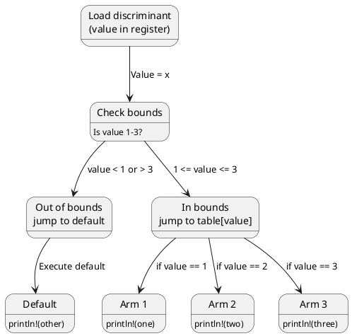
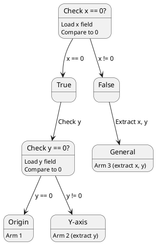
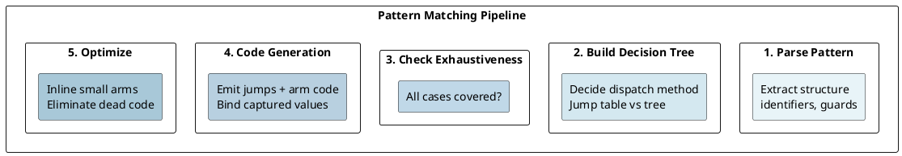

# Pattern Matching: Compilation to Jump Tables and Exhaustiveness

## Overview
Pattern matching is a first-class feature in Rust. The compiler transforms `match` expressions into efficient **jump tables** or **decision trees**, ensuring **exhaustiveness** at compile-time while generating optimal machine code.

---

## 1. Match Expression Compilation

### Simple Match
```rust
let x = 2;
match x {
    1 => println!("one"),
    2 => println!("two"),
    3 => println!("three"),
    _ => println!("other"),
}
```

### Compilation Strategy

The compiler chooses between:
1. **Jump table** - O(1) dispatch (for small integer ranges)
2. **Decision tree** - O(log n) comparisons (for sparse ranges)
3. **Direct comparison** - O(n) comparisons (for small match arms)

### Jump Table (Typical)



---

## 2. Enum Pattern Matching

### Discriminant-based Dispatch
```rust
enum Color {
    Red,
    Green,
    Blue,
}

match color {
    Color::Red => ...,
    Color::Green => ...,
    Color::Blue => ...,
}
```

### Discriminant Values
```rust
// Internal representation (simplified):
enum Color {
    Red = 0,       // discriminant 0
    Green = 1,     // discriminant 1
    Blue = 2,      // discriminant 2
}

// Compiler reads discriminant from memory
// Jumps to corresponding arm
```

### Result/Option Pattern Matching
```rust
match result {
    Ok(val) => process(val),    // discriminant 0
    Err(e) => handle_error(e),  // discriminant 1
}
```

**Discriminants stored inline** in the enum data.

---

## 3. Struct Pattern Matching

### Destructuring Fields
```rust
struct Point {
    x: i32,
    y: i32,
}

match point {
    Point { x: 0, y: 0 } => println!("origin"),
    Point { x: 0, y } => println!("y-axis: {}", y),
    Point { x, y } => println!("({}, {})", x, y),
}
```

### Compilation Strategy: Decision Tree



---

## 4. Guard Clauses

### Adding Conditions
```rust
match x {
    n if n % 2 == 0 => println!("even"),
    n if n > 10 => println!("odd and > 10"),
    _ => println!("other"),
}
```

### Compilation
```
Jump to discriminant arm (if simple enum)
↓
Evaluate guard condition
↓
If true: execute arm
If false: continue to next arm (or default)
```

---

## 5. Exhaustiveness Checking

### Compiler Ensures All Cases
```rust
let x: Option<i32> = Some(42);

// ERROR: match not exhaustive
match x {
    Some(n) => println!("{}", n),
    // Missing: None case
}

// FIXED: handle all cases
match x {
    Some(n) => println!("{}", n),
    None => println!("no value"),
}
```

### How Exhaustiveness Works

```rust
// Compiler builds a decision tree:
// 1. All possible values? → all branches covered
// 2. Missing case? → compiler error

match (x, y) {
    (0, 0) => {},
    (0, _) => {},
    (_, 0) => {},
    (_, _) => {},
}
// All combinations covered ✓

match (x, y) {
    (0, 0) => {},
    (0, _) => {},
    // Missing: (non-0, 0) and (non-0, non-0) → ERROR
}
```

---

## 6. Never Pattern and Unreachable

### Impossible Cases
```rust
enum Infallible {}  // No variants

match infallible {
    // Exhaustive (no cases possible)
}
```

### Unreachable Arms
```rust
match x {
    1 => println!("one"),
    _ => println!("other"),
    1 => println!("never reached!"),  // ERROR: unreachable pattern
}
```

---

## 7. Performance of Match vs If-Else

### Switch-like (Jump Table)
```rust
match x {
    0 => a(),
    1 => b(),
    2 => c(),
    _ => d(),
}
```

**Compiled to:**
- Jump table lookup: O(1)
- Branch prediction friendly
- CPU cache efficient

### If-Else Chain
```rust
if x == 0 {
    a()
} else if x == 1 {
    b()
} else if x == 2 {
    c()
} else {
    d()
}
```

**Compiled to:**
- Multiple comparisons: O(n) worst case
- Branch prediction less friendly
- Slower on average

**Result:** Match is typically faster.

---

## 8. Pattern Matching on Slices

### Slice Patterns
```rust
match arr {
    [] => println!("empty"),
    [a] => println!("single: {}", a),
    [a, b] => println!("pair: {} {}", a, b),
    [a, .., b] => println!("first and last: {} {}", a, b),
    _ => println!("many"),
}
```

### Compilation: Bounds Check + Dispatch
```
1. Check array length
2. Jump to corresponding arm
3. Extract pattern bindings
```

---

## 9. Or Patterns
```rust
match x {
    1 | 2 | 3 => println!("1-3"),
    4..=6 => println!("4-6"),
    _ => println!("other"),
}
```

### Compilation
```
Or patterns merged into single jump table entry:
  table[1] = arm1_handler
  table[2] = arm1_handler  (same as 1)
  table[3] = arm1_handler  (same as 1)
  table[4..=6] = arm2_handler
```

---

## 10. Binding and Move Semantics

### Patterns Capture Values
```rust
match result {
    Ok(value) => println!("{}", value),  // value moved from Ok
    Err(e) => println!("error: {}", e),  // e moved from Err
}
// result consumed (moved)
```

### Reference Patterns
```rust
match &result {  // Match reference
    Ok(value) => println!("{}", value),   // value is &T
    Err(e) => println!("error: {}", e),   // e is &E
}
// result NOT consumed
```

### Mutable Reference Patterns
```rust
match &mut result {
    Ok(value) => *value += 1,  // Can mutate through &mut
    Err(_) => {},
}
```

---

## 11. Nested Patterns

### Deep Matching
```rust
match point {
    Point { x: Point { x: 0, y: 0 }, y: 0 } => ...,
    Point { x, y: 0 } if x > 0 => ...,
    _ => ...,
}
```

### Decision Tree Depth
- Each pattern adds a level
- Deeply nested patterns = deeper decision tree
- More branches = larger code size (code bloat)

---

## 12. Match Expression as Value

### Returning Values
```rust
let value = match x {
    1 => "one",
    2 => "two",
    _ => "other",
};

// All arms must return same type
// Type checked at compile time
```

### With Side Effects
```rust
let result = match config {
    Config::A => {
        println!("Running A");
        expensive_operation_a()
    },
    Config::B => {
        println!("Running B");
        expensive_operation_b()
    },
};
```

---

## 13. Exhaustiveness Algorithm

### Compiler's Approach
```
Given match arms:
1. Build set of all possible values (type)
2. Subtract covered patterns (union of all arms)
3. If remainder non-empty → ERROR: non-exhaustive
4. If remainder empty → OK: exhaustive
```

### Example with Result<T, E>
```rust
enum Result<T, E> {
    Ok(T),    // variant 0
    Err(E),   // variant 1
}

match result {
    Ok(v) => ...,   // covers variant 0
    Err(e) => ...,  // covers variant 1
}
// All variants covered ✓
```

---

## 14. Performance Metrics

### Benchmark
```
Jump table dispatch: 1-2 CPU cycles
Decision tree dispatch: 2-5 CPU cycles (depending on depth)
If-else chain: 1-10 CPU cycles (branch mispredictions)
```

### Code Generation
```rust
// With -O (release):
match x {
    0..=10 => cmp + jmp table      // 1 instruction
    _ => jmp default
}

// Naive if-else:
if x == 0 { ... }
else if x == 1 { ... }
...
// 20 instructions for 10 comparisons
```

---

## Summary Diagram



---

**Next:** [Trait Objects →](15-trait-objects.md) Learn polymorphism, fat pointers, and casting.
