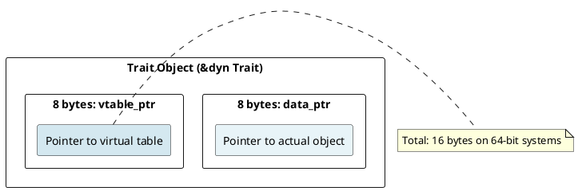
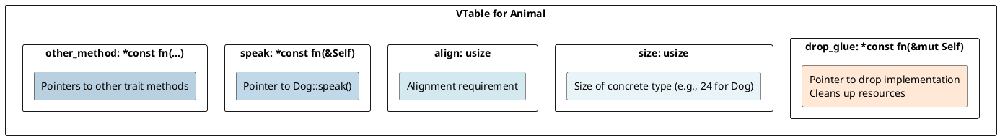
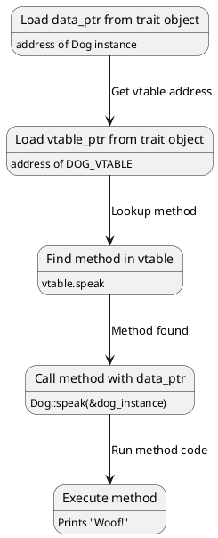
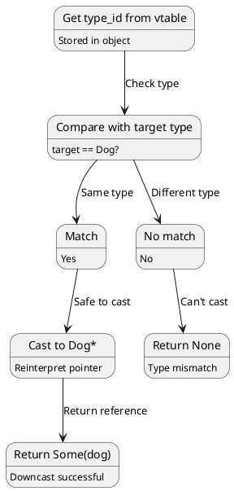
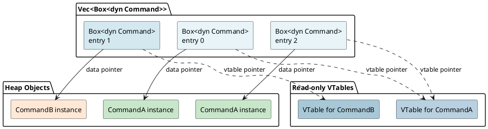
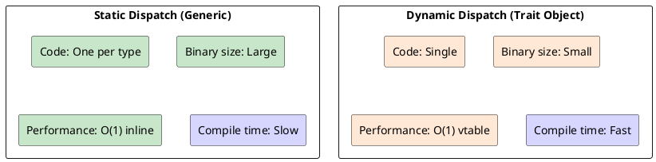

# Trait Objects: Fat Pointers, Polymorphism, and Dynamic Dispatch

## Overview
Trait objects enable **runtime polymorphism** through dynamic dispatch. Implemented as **fat pointers** (data pointer + virtual table pointer), they allow calling methods on unknown concrete types.

---

## 1. Static vs Dynamic Dispatch

### Static Dispatch (Generics)
```rust
fn process<T: Drawable>(item: T) {
    item.draw();  // Resolved at compile time
}

process(circle);    // Generates code for Circle::draw
process(square);    // Generates code for Square::draw
```

**Result:** Separate function for each type (monomorphization).

### Dynamic Dispatch (Trait Objects)
```rust
fn process(item: &dyn Drawable) {
    item.draw();  // Resolved at runtime via vtable
}

process(&circle);   // Same function for all types
process(&square);   // Looks up method in vtable
```

**Result:** Single function, method lookup via pointer.

---

## 2. Trait Object Creation

### Type Erasure
```rust
trait Animal {
    fn speak(&self);
}

impl Animal for Dog {
    fn speak(&self) { println!("Woof!"); }
}

impl Animal for Cat {
    fn speak(&self) { println!("Meow!"); }
}

let dog: Box<dyn Animal> = Box::new(Dog);  // Type erased
let cat: &dyn Animal = &Cat;               // Type erased
```

### Boxing into Trait Objects
```rust
let animals: Vec<Box<dyn Animal>> = vec![
    Box::new(Dog),
    Box::new(Cat),
];

for animal in animals {
    animal.speak();  // Dispatches to correct implementation
}
```

---

## 3. Fat Pointer Structure

### Trait Object Representation



### Box<dyn Trait> Layout
```rust
println!("{}", std::mem::size_of::<Box<dyn Animal>>());  // 16 bytes
println!("{}", std::mem::size_of::<&dyn Animal>());      // 16 bytes

// Compare:
println!("{}", std::mem::size_of::<Box<Dog>>());         // 8 bytes
println!("{}", std::mem::size_of::<&Dog>());             // 8 bytes
```

---

## 4. Virtual Table (vtable)

### VTable Structure



### VTable Creation (Compile-Time)
```rust
// For Dog implementing Animal:
const DOG_VTABLE: &VTable = &VTable {
    drop_glue: <Dog as Drop>::drop,
    size: std::mem::size_of::<Dog>(),
    align: std::mem::align_of::<Dog>(),
    speak: <Dog as Animal>::speak,
};

// For Cat implementing Animal:
const CAT_VTABLE: &VTable = &VTable {
    drop_glue: <Cat as Drop>::drop,
    size: std::mem::size_of::<Cat>(),
    align: std::mem::align_of::<Cat>(),
    speak: <Cat as Animal>::speak,
};
```

---

## 5. Method Dispatch

### Calling Through Trait Object
```rust
let animal: &dyn Animal = &dog;
animal.speak();
```

### Dispatch Sequence



### Assembly-Like Pseudocode
```asm
; Load trait object (16 bytes)
mov rax, [trait_obj]        ; rax = data_ptr
mov rcx, [trait_obj + 8]    ; rcx = vtable_ptr

; Call method
mov r11, [rcx + 24]         ; r11 = vtable.speak (offset 24)
call r11                     ; Call speak(&dog_instance)
```

---

## 6. Object Safety

### Requirements for Trait Objects
```rust
// Object-safe trait: ✓
trait Animal {
    fn speak(&self);
}

// NOT object-safe: ✗ (returns Self)
trait Cloneable {
    fn clone(&self) -> Self;  // ERROR: can't return dyn Trait
}

// NOT object-safe: ✗ (takes Self)
trait Movable {
    fn move_it(self);  // ERROR: can't consume dyn Trait
}
```

### Why Not Object-Safe?
```rust
// This would be impossible:
let animal: &dyn Animal = &dog;
let cloned = animal.clone();  // What type is cloned?
                              // We don't know!
```

**Trait object requires:** all methods can work on `&dyn Trait` (or `&mut`).

---

## 7. Upcasting and Downcasting

### Upcasting (Safe)
```rust
let dog: Dog = Dog;
let animal: &dyn Animal = &dog;  // Upcast (always safe)
```

### Downcasting (Unsafe)
```rust
use std::any::Any;

let animal: &dyn Any = &dog;

if let Some(dog) = animal.downcast_ref::<Dog>() {
    println!("It's a dog!");
}
```

### Downcast Sequence



---

## 8. Performance Cost of Dynamic Dispatch

### Method Call Overhead

```
Static dispatch (inline):
call Dog::speak
(function address known, CPU can inline)

Dynamic dispatch (vtable):
mov rax, [vtable]           ; Load vtable
mov rcx, [rax + offset]     ; Load method pointer
call rcx                    ; Indirect call (1-2 cycle penalty)
```

**Cost:** 1-2 CPU cycles per method call (cache misses possible).

### Benchmark
```
Direct call: 1 ns
Virtual call: 3-5 ns (3-5× overhead for small methods)
```

---

## 9. Trait Object with Associated Types

### Associated Types Not Object-Safe
```rust
trait Container {
    type Item;
    fn get(&self) -> Self::Item;
}

// Can't create trait object (Item type unknown)
let c: Box<dyn Container> = Box::new(...);  // ERROR
```

**Reason:** Associated type must be concrete, but type erased.

---

## 10. Trait Objects and Ownership

### Box<dyn Trait>
```rust
let animal: Box<dyn Animal> = Box::new(Dog);
// Box owns Dog
// When Box dropped, Dog dropped

drop(animal);  // Dog cleaned up via drop_glue
```

### Reference &dyn Trait
```rust
let dog = Dog;
let animal: &dyn Animal = &dog;

// &dyn Animal doesn't own Dog
// Dog must live longer than reference
```

---

## 11. VTable Encoding

### Type Information in VTable
```rust
// VTable contains:
struct VTable {
    drop_fn: unsafe fn(*mut ()),      // Drop implementation
    size: usize,                       // Size of concrete type
    align: usize,                      // Alignment
    
    // Method pointers (in declaration order)
    method1: unsafe fn(*const ()),
    method2: unsafe fn(*const (), i32),
    // ... more methods
}
```

### Multiple Trait Objects
```rust
trait A { fn a(&self); }
trait B { fn b(&self); }

impl A for Dog { fn a(&self) { ... } }
impl B for Dog { fn b(&self) { ... } }

let a: &dyn A = &dog;  // VTable for A
let b: &dyn B = &dog;  // VTable for B (different)

// Two different trait objects for same Dog!
```

---

## 12. Combining Multiple Traits

### Supertraits
```rust
trait Animal: Drawable + Named {
    fn speak(&self);
}

impl Animal for Dog {
    fn speak(&self) { println!("Woof"); }
}

// Dog must implement Drawable + Named too
let animal: &dyn Animal = &dog;  // VTable includes methods from Drawable, Named
```

### Trait Object with Multiple Bounds
```rust
fn process(item: &(dyn Animal + Send + Sync)) {
    // Can call Animal methods
    // Guaranteed to be Send + Sync
}
```

---

## 13. Example: Polymorphic Vec

```rust
trait Command {
    fn execute(&mut self);
}

struct Commands(Vec<Box<dyn Command>>);

impl Commands {
    fn run(&mut self) {
        for cmd in &mut self.0 {
            cmd.execute();  // Dispatch through vtable
        }
    }
}
```

### Memory Layout



---

## 14. Comparison: Static vs Dynamic



---

## Summary

| Aspect | Trait Object | Generic |
|--------|-------------|---------|
| **Dispatch** | Dynamic (runtime) | Static (compile-time) |
| **Fat Pointer** | 16 bytes (ptr + vtable) | N/A |
| **Type Erasure** | Yes | No |
| **Code Size** | Smaller | Larger (monomorphization) |
| **Speed** | Slightly slower | Faster (inlining) |
| **Object Safety** | Required | N/A |

---

**Next:** [Concurrency & Threading →](17-concurrency.md) Learn threads, channels, atomics, memory ordering.
