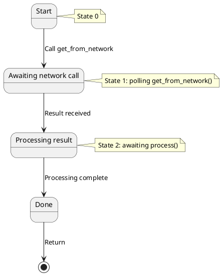
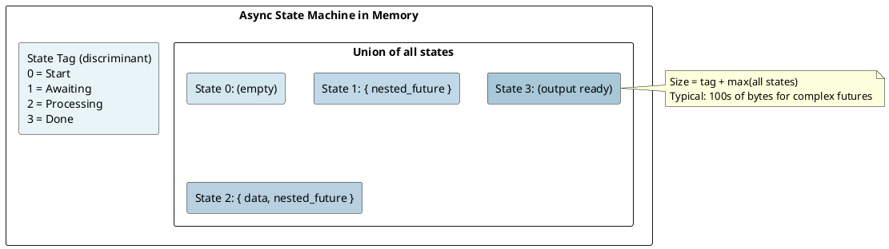
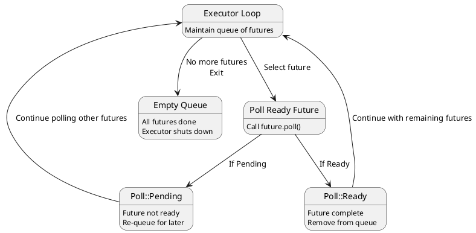
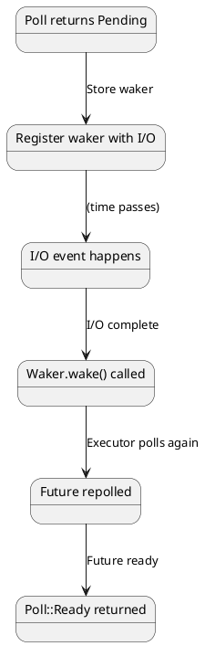
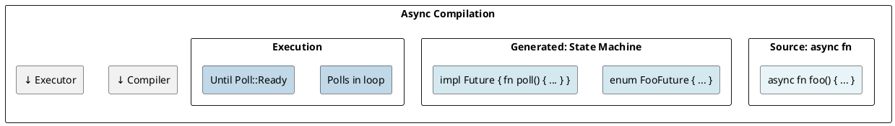

# Async/Await & Futures: State Machines Under the Hood

## Overview
`async/await` is syntactic sugar for **state machines**. The compiler transforms async functions into types implementing the `Future` trait. Understanding this transformation is key to knowing why async is zero-cost and how it enables high-concurrency.

---

## 1. Futures: The Foundation

### What is a Future?
A Future is a value that will eventually produce a result:

```rust
pub trait Future {
    type Output;

    fn poll(mut self: Pin<&mut Self>, cx: &mut Context<'_>) -> Poll<Self::Output>;
}

pub enum Poll<T> {
    Ready(T),
    Pending,
}
```

**Semantics:**
- **poll()** - tries to make progress toward completion
- **Poll::Ready(T)** - computation completed, here's the result
- **Poll::Pending** - not ready yet, call poll() again later

---

## 2. Async Functions as State Machines

### Simple Async Function
```rust
async fn fetch_data() -> String {
    let data = get_from_network().await;
    process(data).await
}
```

### Compiler Transformation
The compiler transforms the above into:



**Generated state machine (conceptual):**

```rust
enum FetchDataFuture {
    Start,
    AwaitingNetwork {
        future: GetFromNetworkFuture,
    },
    Processing {
        data: String,
        future: ProcessFuture,
    },
    Done,
}

impl Future for FetchDataFuture {
    type Output = String;

    fn poll(mut self: Pin<&mut Self>, cx: &mut Context) -> Poll<String> {
        match self {
            FetchDataFuture::Start => {
                // Initialize, transition to AwaitingNetwork
                *self = FetchDataFuture::AwaitingNetwork { future: ... };
                self.poll(cx)  // Poll again
            },
            FetchDataFuture::AwaitingNetwork { ref mut future } => {
                match Pin::new(future).poll(cx) {
                    Poll::Pending => Poll::Pending,
                    Poll::Ready(data) => {
                        *self = FetchDataFuture::Processing { data, future: ... };
                        self.poll(cx)
                    }
                }
            },
            FetchDataFuture::Processing { ref mut future, ... } => {
                match Pin::new(future).poll(cx) {
                    Poll::Pending => Poll::Pending,
                    Poll::Ready(result) => {
                        *self = FetchDataFuture::Done;
                        Poll::Ready(result)
                    }
                }
            },
            FetchDataFuture::Done => panic!("polled after completion"),
        }
    }
}
```

---

## 3. Await Points and Suspension

### How Await Works
```rust
async fn example() {
    let x = some_async_op().await;  // Await point
    println!("{}", x);
}
```

**At compile time:**
1. Convert to state machine
2. Each `await` is a state transition point
3. **Suspend** = return `Poll::Pending`
4. **Resume** = poll() called again from same state

### State Machine Memory Layout



---

## 4. The Executor Model

### How Futures Get Polled
```rust
#[tokio::main]
async fn main() {
    let future = async {
        println!("Hello");
    };
    // Tokio executor polls the future to completion
}
```

**Execution flow:**



---

## 5. Pin and Unpin

### Why Pin Exists
Async state machines contain **self-referential data**:

```rust
// Example: state machine with pointer to itself
enum MyFuture {
    State {
        data: String,
        ptr_to_data: *const String,  // Points to field above!
    },
}

// If we move the struct, the pointer becomes invalid!
// Pin prevents moving after first poll()
```

### Pin Semantics

```rust
pub struct Pin<P> {
    pointer: P,  // Pointer to data
    // Promises data won't move
}

// Can't move if pinned
let mut future = async { ... };
let pinned = Pin::new(&mut future);
// Future must not move after this point!
```

### Unpin Trait
```rust
pub auto trait Unpin {}  // Most types implement Unpin

// Types that don't implement Unpin:
// - Futures with self-references
// - Types with PhantomPinned
```

---

## 6. Context and Wakers

### Context
```rust
pub fn poll(mut self: Pin<&mut Self>, cx: &mut Context) -> Poll<Output>;
```

**Context contains:**
- **Waker** - tells executor to poll this future again

### Waker
```rust
// When waiting for I/O:
pub trait Waker {
    fn wake(&self);  // Tell executor: "I'm ready now!"
}

// In future implementation:
fn poll(mut self: Pin<&mut Self>, cx: &mut Context) -> Poll<T> {
    // Register waker with I/O system
    io_system.register_callback(cx.waker().clone());
    Poll::Pending  // Not ready yet
    // When I/O completes, io_system calls waker.wake()
    // Executor polls this future again
}
```

**Notification flow:**



---

## 7. Async Function Transformation

### Simple Example
```rust
async fn greet() -> String {
    "Hello".to_string()
}
```

**Transforms into:**
```rust
fn greet() -> impl Future<Output = String> {
    struct GreetFuture;

    impl Future for GreetFuture {
        type Output = String;

        fn poll(self: Pin<&mut Self>, _cx: &mut Context) -> Poll<String> {
            Poll::Ready("Hello".to_string())
        }
    }

    GreetFuture
}
```

### With Await
```rust
async fn fetch_and_greet() -> String {
    let greeting = greet().await;
    format!("{}, World!", greeting)
}
```

**Transforms into state machine** (similar to earlier example).

---

## 8. Move Semantics in Async

### Capturing Variables
```rust
let name = "Alice".to_string();

let future = async {
    println!("Hello, {}", name);  // Captures name
};
```

**Closure behavior:**
- Immutable closure if only read
- Mutable closure if modified
- Consumes (moves) if needed

The state machine captures `name` as a field.

### Problematic Move
```rust
async fn problem() {
    let x = vec![1, 2, 3];
    let fut = async {
        drop(x);  // Future owns x (moved)
    };
    // x no longer available here - moved into fut
}
```

---

## 9. Async/Await Performance

### Zero-Cost Abstraction
```rust
// This:
async fn work() {
    a().await;
    b().await;
}

// Compiles roughly to:
fn work() -> impl Future {
    // State machine with states for each await point
    // No heap allocation by default (stack-based)
    // Calls functions directly (no indirection)
}
```

**Cost:** Only the state machine enum size (typically hundreds of bytes) + actual computation.

### Benchmark
```
Sync function call: 1-2 cycles
Async function poll: 1-2 cycles (same!)
Overhead: Only when awaiting on I/O
```

---

## 10. Cancellation and Drop

### Dropping a Future
```rust
async fn long_task() {
    // Some work
}

let future = long_task();
drop(future);  // Drops the entire state machine
               // Cleans up any resources
```

The state machine's `Drop` impl cleans up **nested futures** and **resources**.

### Cancellation Safety
```rust
select! {
    _ = fut1 => {},
    _ = fut2 => {},
}
// One future may be dropped mid-execution!
```

Futures must implement **cancellation-safe** cleanup.

---

## 11. Common Async Patterns

### Spawn Task
```rust
tokio::spawn(async {
    // Runs independently
});
```

### Race Futures
```rust
tokio::select! {
    res1 = future1 => { ... }
    res2 = future2 => { ... }
}
```

### Join Futures
```rust
let (res1, res2) = tokio::join!(future1, future2);
```

---

## 12. Heap Allocation in Async

### Stack vs Heap
```rust
// Stack (preferred):
async fn stack_based() {
    let fut = simple_future();  // Stack-based state machine
    fut.await;
}

// Heap (when needed):
async fn heap_based() {
    let fut = Box::new(large_future());  // On heap
    fut.await;
}
```

Most async code is **stack-based** (no heap allocation).

---

## Summary Diagram



---

**Next:** [Tokio Runtime →](19-tokio.md) Learn event-driven I/O architecture.
