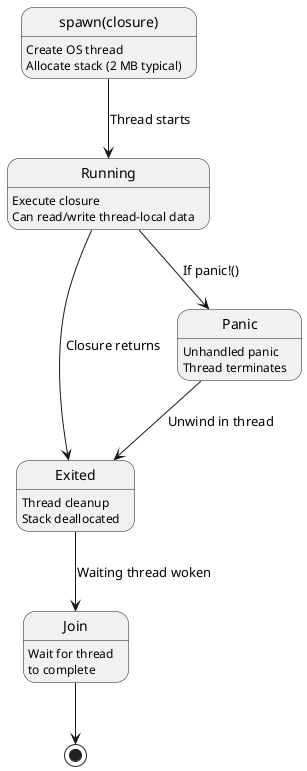
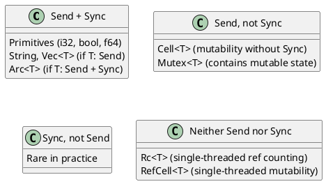
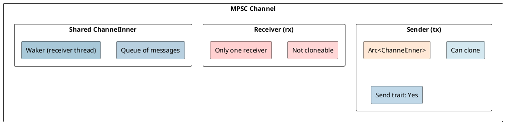
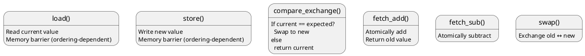
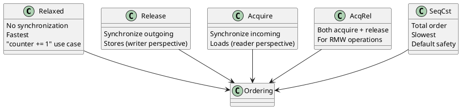
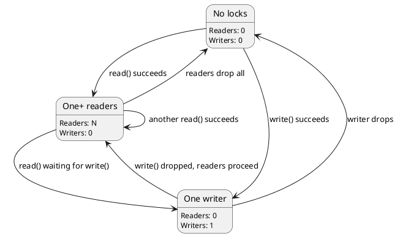
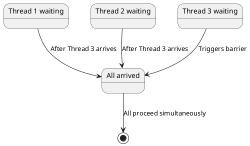
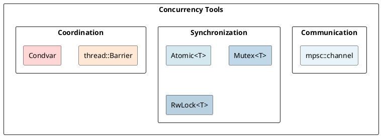

# Concurrency: Threads, Channels, Atomics, Memory Ordering Under the Hood

## Overview
Rust's concurrency model guarantees **thread safety** through Send/Sync traits and **memory safety** through ownership. Synchronization primitives (channels, atomics) build on these foundations to coordinate work across threads.

---

## 1. Threads and OS-Level Parallelism

### Creating Threads
```rust
use std::thread;

thread::spawn(|| {
    println!("Hello from thread");
});

// Main thread continues
```

### Thread Lifecycle



### Stack Allocation
```rust
let handle = thread::spawn(|| {
    // New OS thread created
    // Stack allocated: ~2 MB (Linux typical)
    // Stack pointer initialized
    // closure executed within this stack
});

handle.join().expect("Thread panicked");  // Wait for completion
```

---

## 2. Send and Sync Traits

### Send Trait
```rust
pub trait Send: Sized {}
// T: Send if ownership can be transferred across threads

// Example: String is Send
fn use_in_thread<T: Send>(t: T) {
    thread::spawn(move || {
        println!("{:?}", t);  // t moved into thread
    });
}
```

### Sync Trait
```rust
pub trait Sync: Sized {}
// T: Sync if &T can be shared between threads safely

// Example: Arc<T> is Sync if T: Send + Sync
fn use_shared<T: Sync>(t: &T) {
    thread::spawn(move || {
        println!("{:?}", t);  // &t shared with thread
    });
}
```

### Common Types



---

## 3. Channels: MPSC Communication

### Channel Creation
```rust
use std::sync::mpsc;

let (tx, rx) = mpsc::channel();

thread::spawn(move || {
    tx.send(42).unwrap();  // Send value through channel
});

let value = rx.recv().unwrap();  // Receive on main thread
println!("{}", value);
```

### Channel Architecture



### Blocking Semantics
```rust
// Sender blocks if channel full (bounded channel)
let (tx, rx) = mpsc::channel::<i32>();  // Unbounded
let (tx, rx) = mpsc::sync_channel(10);   // Bounded (max 10 messages)

tx.send(value)?;  // Blocks if 10 messages queued

// Receiver blocks until message available
rx.recv()?;  // Blocks
rx.try_recv()?;  // Non-blocking (returns Err if empty)
```

---

## 4. Multiple Producers

### Cloning Senders
```rust
let (tx, rx) = mpsc::channel();

let tx1 = tx.clone();
let tx2 = tx.clone();

thread::spawn(move || {
    tx1.send(1).unwrap();
});

thread::spawn(move || {
    tx2.send(2).unwrap();
});

while let Ok(val) = rx.recv() {
    println!("{}", val);  // Receives 1 and 2
}
```

### Reference Counting
```
Initial: Sender count = 1
Clone 1: Sender count = 2
Clone 2: Sender count = 3
...
Drop all clones: count = 0
Receiver.recv() returns Err (channel closed)
```

---

## 5. Atomics: Lock-Free Synchronization

### AtomicU32
```rust
use std::sync::atomic::{AtomicU32, Ordering};

let counter = AtomicU32::new(0);

thread::spawn(|| {
    counter.fetch_add(1, Ordering::SeqCst);  // Atomic increment
});

thread::spawn(|| {
    counter.fetch_add(1, Ordering::SeqCst);  // Atomic increment
});

// Result: 2 (no race condition)
```

### Atomic Size
```rust
println!("{}", std::mem::size_of::<AtomicU32>());  // 4 (same as u32)
println!("{}", std::mem::size_of::<AtomicU64>());  // 8 (same as u64)
```

### Atomic Operations



---

## 6. Memory Ordering

### Ordering Options



### Ordering Semantics

```rust
use std::sync::atomic::{AtomicU32, Ordering::*};

let data = AtomicU32::new(0);

// Relaxed: no barrier
data.store(42, Relaxed);           // No synchronization

// Release: write barrier
data.store(42, Release);           // Other threads see all prior writes

// Acquire: read barrier
let val = data.load(Acquire);      // Ensure all later reads see this

// SeqCst: sequential consistency
data.store(42, SeqCst);            // Total order over all threads
```

---

## 7. Atomics vs Mutex

### Lock-Free Atomics
```rust
use std::sync::atomic::{AtomicU64, Ordering};

let counter = Arc::new(AtomicU64::new(0));

for _ in 0..100 {
    let counter_clone = Arc::clone(&counter);
    thread::spawn(move || {
        counter_clone.fetch_add(1, Ordering::SeqCst);  // No locks!
    });
}

// No contention, no blocking
```

### Mutex-Based
```rust
use std::sync::Mutex;

let counter = Arc::new(Mutex::new(0u64));

for _ in 0..100 {
    let counter_clone = Arc::clone(&counter);
    thread::spawn(move || {
        let mut guard = counter_clone.lock().unwrap();
        *guard += 1;  // Locked
    });
}

// Contention possible, may block
```

### Performance
```
AtomicU64::fetch_add: 1-2 cycles
Mutex::lock: 10-100 cycles (depending on contention)
```

---

## 8. Compare-and-Swap (CAS)

### Atomic CAS
```rust
use std::sync::atomic::{AtomicU32, Ordering};

let expected = 10;
let new = 20;
let atomic = AtomicU32::new(10);

match atomic.compare_exchange(expected, new, Ordering::SeqCst, Ordering::Acquire) {
    Ok(old) => println!("Swapped: {} → {}", old, new),
    Err(actual) => println!("Failed: {} != {}", actual, expected),
}
```

### Lock-Free Loops
```rust
use std::sync::atomic::{AtomicU32, Ordering};

let value = AtomicU32::new(0);

loop {
    let current = value.load(Ordering::Acquire);
    let new = current + 1;

    match value.compare_exchange(
        current,
        new,
        Ordering::Release,
        Ordering::Relaxed
    ) {
        Ok(_) => break,      // Success
        Err(_) => continue,  // Retry (another thread beat us)
    }
}
```

---

## 9. Thread-Local Storage

### thread_local! Macro
```rust
thread_local! {
    static BUFFER: RefCell<Vec<u8>> = RefCell::new(Vec::new());
}

BUFFER.with(|buf| {
    buf.borrow_mut().push(42);
});
```

### Implementation
```
Each thread has its own instance of BUFFER
No synchronization needed (no sharing)
Per-thread overhead: 8 bytes (pointer to thread-local data)
```

---

## 10. RwLock: Read-Write Synchronization

### Multiple Readers, Single Writer
```rust
use std::sync::RwLock;

let data = RwLock::new(vec![1, 2, 3]);

// Multiple threads can read simultaneously
let read_guard1 = data.read().unwrap();
let read_guard2 = data.read().unwrap();

// Writer waits for all readers
// let write_guard = data.write().unwrap();  // Would block until readers drop
```

### Reader-Writer State



---

## 11. Barrier Synchronization

### Barrier
```rust
use std::sync::Barrier;

let barrier = Arc::new(Barrier::new(3));  // Wait for 3 threads

for _ in 0..3 {
    let barrier_clone = Arc::clone(&barrier);
    thread::spawn(move || {
        println!("Thread waiting");
        barrier_clone.wait();  // Wait for all 3
        println!("All threads reached");
    });
}
```

### Barrier Execution



---

## 12. Thread Panic Propagation

### Panic in Thread
```rust
let handle = thread::spawn(|| {
    panic!("Error!");
});

match handle.join() {
    Ok(_) => println!("Success"),
    Err(_) => println!("Thread panicked"),
}
```

### Panic Isolation
```
Main thread:  [running]  [join]  [continue]
Worker thread:                   [panic!]  [unwind + exit]

Main thread is NOT affected by worker panic
```

---

## 13. Performance Characteristics

### Overhead

```
Creating thread: 1-10 ms (OS scheduling)
Atomic operation: 1-10 cycles
Channel send: 50-500 cycles (depends on contention)
Mutex lock: 10-1000 cycles (uncontended to contended)
Context switch: 100-10,000 cycles
```

---

## 14. Anti-Patterns

### WRONG: Sharing Rc<T>
```rust
let data = Rc::new(42);  // NOT thread-safe!
let clone = Rc::clone(&data);

thread::spawn(move || {
    println!("{}", clone);  // ERROR: Rc not Send
});
```

### CORRECT: Use Arc<T>
```rust
let data = Arc::new(42);  // Thread-safe ref counting
let clone = Arc::clone(&data);

thread::spawn(move || {
    println!("{}", clone);  // OK: Arc is Send
});
```

---

## Summary Diagram



---

**Next:** [Rayon Parallelism →](18-rayon.md) Learn data-parallelism with work-stealing.
