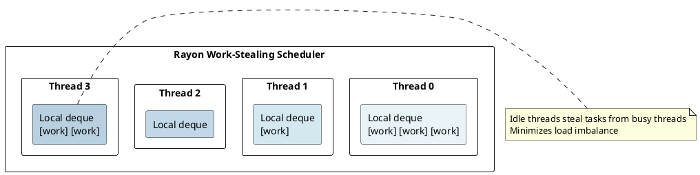
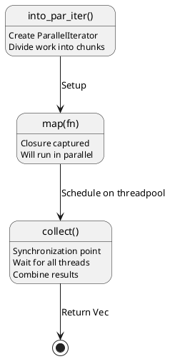
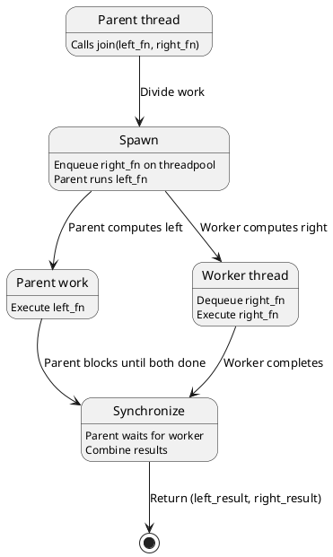
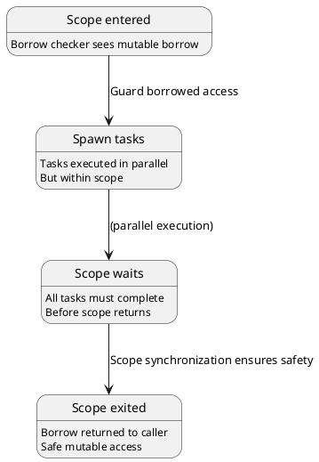
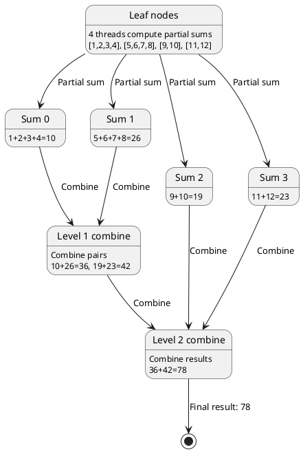
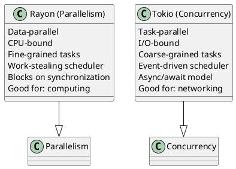
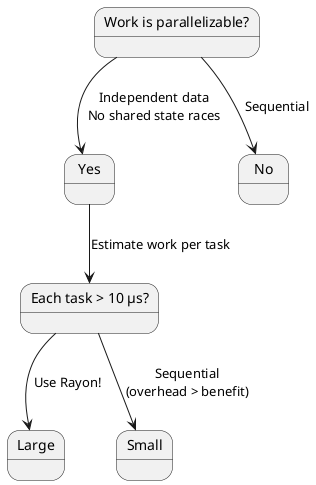

# Rayon: Data Parallelism with Work-Stealing Under the Hood

## Overview
Rayon provides **data-parallel** abstractions using a **work-stealing scheduler**. Unlike Tokio (task-parallel, async), Rayon targets **CPU-bound parallel computations** with declarative API that parallelizes iterators automatically.

---

## 1. Parallelism vs Concurrency

### Parallelism (Rayon)
```rust
use rayon::prelude::*;

let sum: i32 = (1..1000)
    .into_par_iter()
    .map(|x| x * x)
    .sum();
```

**Characteristics:**
- Multiple threads execute **simultaneously**
- Work on **independent data**
- CPU-bound (compute-intensive)
- Goal: utilize all CPU cores

### Concurrency (Tokio)
```rust
#[tokio::main]
async fn main() {
    let fut1 = some_io_operation();
    let fut2 = some_io_operation();
    
    let (r1, r2) = tokio::join!(fut1, fut2);
}
```

**Characteristics:**
- Single or few threads **interleave** work
- Work on **shared state**
- I/O-bound (I/O-intensive)
- Goal: handle many concurrent operations

---

## 2. Rayon Work-Stealing Scheduler

### Thread Pool
```rust
use rayon::prelude::*;

// Default: thread pool with CPU core count threads
let pool = rayon::ThreadPoolBuilder::new()
    .num_threads(4)  // Explicit control
    .build()
    .unwrap();

pool.install(|| {
    (0..100)
        .into_par_iter()
        .for_each(|i| println!("{}", i));
});
```

### Work-Stealing Queue Structure



---

## 3. Iterator Parallelization

### Sequential Iterator
```rust
let result: Vec<i32> = (0..1000)
    .iter()
    .map(|x| x * 2)
    .collect();
```

**Execution:** Single thread processes all 1000 elements sequentially.

### Parallel Iterator
```rust
use rayon::prelude::*;

let result: Vec<i32> = (0..1000)
    .into_par_iter()
    .map(|x| x * 2)
    .collect();
```

**Execution:** Multiple threads work on chunks in parallel.

### Compiler Transformation



---

## 4. Work Division Strategy

### Divide and Conquer
```rust
(0..1000).into_par_iter().map(f).collect()
```

**Thread pool with 4 threads:**

```
Iteration 0-249:   Thread 0 (chunk 0)
Iteration 250-499: Thread 1 (chunk 1)
Iteration 500-749: Thread 2 (chunk 2)
Iteration 750-999: Thread 3 (chunk 3)
```

### Dynamic Load Balancing
```
Initial state:
  Thread 0: [chunk0: 250 tasks]  ← Busy
  Thread 1: [chunk1: 250 tasks]  ← Busy
  Thread 2: [chunk2: 250 tasks]  ← Busy
  Thread 3: [chunk3: 250 tasks]  ← Busy

If Thread 0 finishes early:
  Thread 0: []                    ← Idle
  → Steals work from Thread 1
  → Now helps finish Thread 1's chunk
```

**Result:** Better CPU utilization than naive chunking.

---

## 5. Join and Fork

### Explicit Parallelism
```rust
use rayon::prelude::*;

let (left, right) = rayon::join(
    || expensive_left_computation(),
    || expensive_right_computation()
);
// left and right computed in parallel
```

### join() Implementation



---

## 6. Divide and Conquer Example

### Merge Sort with Rayon
```rust
fn merge_sort(v: &mut [i32]) {
    if v.len() <= 1000 {
        // Base case: sort sequentially (small)
        v.sort();
    } else {
        let mid = v.len() / 2;
        rayon::join(
            || merge_sort(&mut v[..mid]),
            || merge_sort(&mut v[mid..])
        );
        // Merge halves
    }
}
```

**Parallel execution tree:**

```
                [full array]
                /          \
         (parallel)      (parallel)
           /                    \
      [left half]           [right half]
       /      \              /      \
      /        \            /        \
    ...       ...         ...        ...
    
At leaf (1000 elements): sequential sort
Then merge back up the tree in parallel
```

---

## 7. Thread Safety and Scope

### Scope Guards Ownership
```rust
let mut data = vec![1, 2, 3];

rayon::scope(|s| {
    s.spawn(|_| {
        // Can capture &mut data safely
        data[0] = 10;
    });
    s.spawn(|_| {
        data[1] = 20;
    });
    // Scope waits for all spawns to complete before returning
});

println!("{:?}", data);  // [10, 20, 3]
```

**Safety mechanism:**



---

## 8. Reduction and Combine

### Parallel Reduce
```rust
use rayon::prelude::*;

let sum: i32 = (1..1000)
    .into_par_iter()
    .reduce(|| 0, |a, b| a + b);
```

**Execution model:**

```
[1,2,3,4,5,6,7,8]

Thread 0: 1+2+3+4 = 10
Thread 1: 5+6+7+8 = 26
Main:    10+26 = 36
```

### Tree Reduction (binary tree combine)



---

## 9. Rayon vs Tokio

### Comparison



---

## 10. Memory Model

### No Shared State Mutations (Usually)
```rust
// Safe: each thread has its own closure
(0..1000)
    .into_par_iter()
    .for_each(|i| {
        let local_var = i * 2;  // Thread-local
        println!("{}", local_var);  // No races
    });
```

### Shared State with Thread-Safe Types
```rust
use std::sync::atomic::AtomicU64;
use std::sync::Arc;

let counter = Arc::new(AtomicU64::new(0));

(0..1000)
    .into_par_iter()
    .for_each(|_| {
        counter.fetch_add(1, Relaxed);  // Thread-safe atomic
    });
```

---

## 11. Performance Characteristics

### When Rayon Excels
```
Parallel sum of 1 million numbers:
Seq:   1000 ms
Par:   250 ms (4 threads)
Speedup: 4× (near-linear!)

Reason: CPU-bound, embarrassingly parallel
```

### When Rayon Struggles
```
Parallel: send value over channel:
Seq:   100 ns
Par:   10 μs (contention on lock-free queue!)
Slowdown: 100×

Reason: Too much synchronization overhead
```

---

## 12. Example: Parallel Map Reduce

```rust
use rayon::prelude::*;
use std::collections::HashMap;

let data = vec![1, 2, 3, 4, 5, 6, 7, 8];

// Parallel map
let counts: Vec<(i32, usize)> = data
    .into_par_iter()
    .map(|x| (x, 1))
    .collect();

// Parallel reduce to combine
let result: HashMap<i32, usize> = counts
    .into_par_iter()
    .reduce(
        HashMap::new,
        |mut map, (k, v)| {
            *map.entry(k).or_insert(0) += v;
            map
        }
    );
```

---

## 13. Overhead and When to Use

### Overhead
```
Spawning a task: ~1-10 μs
Stealing work: ~100 ns

Only parallelize if:
- Task > 10 μs of work
- Multiple tasks with good locality
```

### Decision Tree



---

## 14. Thread Pool Internals

### Stealing Algorithm
```
If local_queue is not empty:
  Pop task from local_queue
  Execute task
Else (idle):
  For each other thread:
    Try to steal from other.queue
    If successful: execute
    Else: continue to next
  If nothing stolen:
    Thread parks (waits for work)
```

### Wake-up
```
When new work enqueued:
1. Check for idle threads
2. Wake one thread (unpark)
3. Woken thread dequeues work
4. Other threads steal as needed
```

---

## Summary

| Aspect | Rayon | Tokio |
|--------|-------|-------|
| **Best for** | CPU-bound parallelism | I/O-bound concurrency |
| **Scheduling** | Work-stealing | Event-driven |
| **Threads** | One per CPU core | Configurable |
| **Blocking** | Allowed (efficient) | Problematic (starves executor) |
| **Scalability** | O(cores) | O(tasks) |

---

**Next:** [Concurrency & Threads →](17-concurrency.md) Learn threading, channels, atomics.
