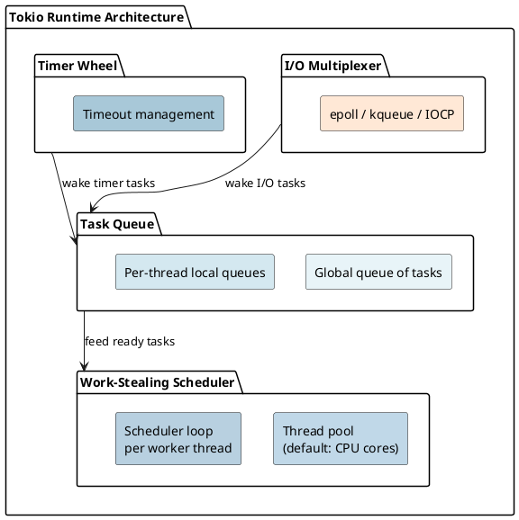
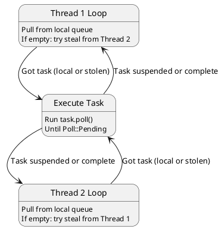
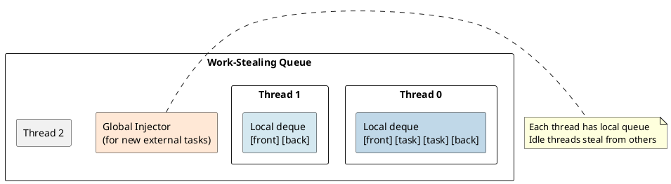
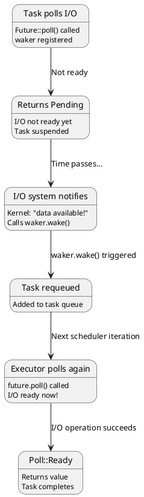
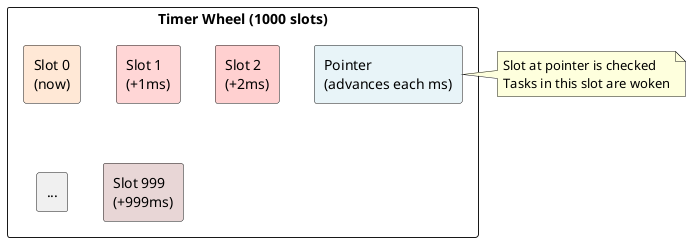
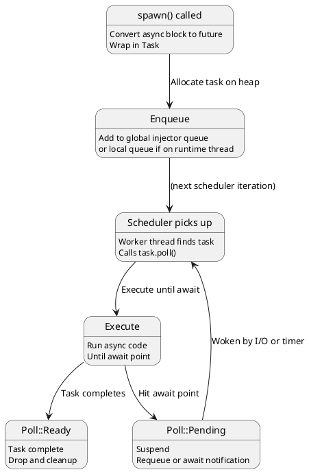
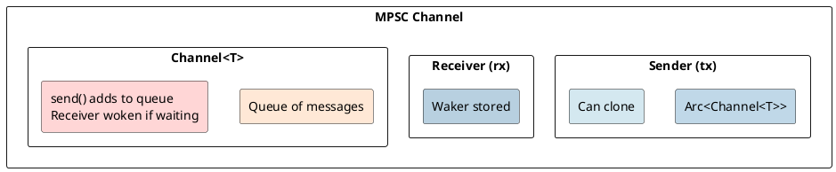
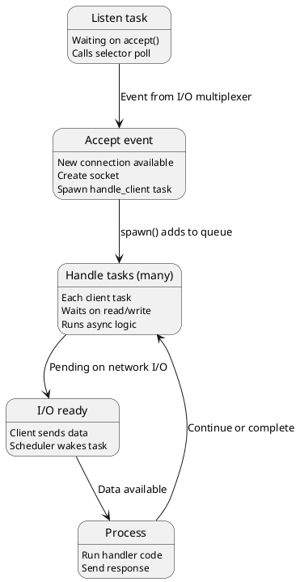

# Tokio Async Runtime: I/O Multiplexing and Scheduling Under the Hood

## Overview
Tokio is an **asynchronous runtime** built on top of Rust's Future trait. It provides sophisticated I/O multiplexing, work-stealing schedulers, and efficient resource management—all to enable high-concurrency applications with minimal overhead.

---

## 1. What is a Runtime?

### The Runtime's Job
```rust
#[tokio::main]
async fn main() {
    // Runtime manages:
    // 1. Spawning and scheduling tasks
    // 2. Polling futures to completion
    // 3. I/O notifications (epoll, kqueue, IOCP)
    // 4. Timers and timeouts
}
```

**Without runtime:** Futures sit idle. Nobody calls `poll()`.

**With Tokio runtime:** Futures are continuously polled until completion.

---

## 2. Tokio Architecture

### High-Level Design



---

## 3. Work-Stealing Scheduler

### Problem: Load Balancing
```
Thread 1: Busy with heavy task
Thread 2: Idle, nothing to do

Result: CPU 2 is wasted!
```

### Solution: Work Stealing
```
Thread 1: Busy
Thread 2: Idle → "Steal" a task from Thread 1's queue

Result: Both threads busy!
```

**Implementation:**



### Work Queue Structure



---

## 4. I/O Multiplexing

### The Challenge
```
1000 concurrent connections
→ Can't create 1000 threads (too expensive)
→ Need single thread to monitor ALL connections

Solution: I/O multiplexing (epoll, kqueue, IOCP)
```

### Epoll (Linux)
```rust
// Conceptual epoll usage:
let epoll_fd = epoll_create();

// Register socket for reading
epoll_ctl(epoll_fd, socket_fd, EPOLLIN);

// Wait for events:
epoll_wait(epoll_fd, events, timeout);
// Returns when: socket readable, timeout, or signal
```

### Event Notification Flow



### Multiplexing Efficiency

```
Without multiplexing (thread per connection):
- 1000 connections → 1000 threads
- Stack per thread: 2 MB
- Memory: 2 GB just for stacks!
- Context switching: O(n) overhead

With I/O multiplexing (1 thread, 1000 connections):
- Stack: 2 MB (single thread)
- Scheduling: O(connections with events) overhead
- epoll_wait: O(1) notification for readiness
```

---

## 5. Timer Wheel

### Problem: Many Timeouts
```rust
tokio::time::sleep(Duration::from_secs(10)).await;  // 10,000 tasks with timeouts

Naive approach: sorted list
→ Insert: O(n), check expiry: O(n)
→ Thousands of timeouts → slow!
```

### Solution: Timer Wheel (Ring Buffer)
```
Slot 0: Tasks expiring now
Slot 1: Tasks expiring in 1 ms
Slot 2: Tasks expiring in 2 ms
...
Slot 999: Tasks expiring in 999 ms

Each ms: advance pointer, wake all in slot
Insert: O(1)
Check: O(1) per advancing tick
```

**Visualization:**



---

## 6. Task Spawning

### Spawn a Task
```rust
tokio::spawn(async {
    // Runs independently on thread pool
});
```

### Internal Flow



---

## 7. Runtime Configuration

### Default Runtime
```rust
#[tokio::main]
async fn main() {
    // Multi-threaded runtime
    // Threads = CPU cores
    // Work-stealing enabled
}
```

### Single-Threaded
```rust
#[tokio::main(flavor = "current_thread")]
async fn main() {
    // Single thread only
    // Simpler, less overhead
    // No work-stealing (unnecessary)
}
```

### Tuning
```rust
use tokio::runtime;

let rt = runtime::Builder::new_multi_thread()
    .worker_threads(4)  // Number of threads
    .thread_name("worker")
    .build()?;

rt.block_on(async {
    // Run async code
});
```

---

## 8. Blocking Operations

### Problem: CPU-Bound Work
```rust
async fn process_data() {
    let result = expensive_computation();  // Blocks executor!
    // While this thread is blocked, other tasks can't progress
}
```

### Solution: block_in_place
```rust
async fn process_data() {
    let result = tokio::task::block_in_place(|| {
        expensive_computation()  // Blocks, but scheduler handles it
    });
}
```

**Internal handling:**
1. Current thread signals: "I'm going to block"
2. Scheduler spins up replacement thread
3. Block completes
4. Continue on any available thread

---

## 9. Channels

### MPSC (Multiple Producer, Single Consumer)
```rust
let (tx, mut rx) = tokio::sync::mpsc::channel(100);

tokio::spawn(async move {
    tx.send(42).await;
});

if let Some(val) = rx.recv().await {
    println!("{}", val);
}
```

### Implementation



---

## 10. Efficiency Characteristics

### Memory Usage
```
Per task:
- Future state: depends on async fn (typically 100-1000 bytes)
- Task metadata: 64 bytes
- No separate stack (stack-based state machine)

1 million tasks: 100 MB - 1 GB (reasonable!)
1 million threads: 2 TB (impossible!)
```

### CPU Efficiency
```
Operations per task per scheduler iteration:
1. Dequeue task: O(1)
2. Poll future: O(1) - depends on async operation
3. Re-queue if Pending: O(1)

Total: O(1) per operation
```

---

## 11. Tokio Task Model

### Task vs Future
```rust
// Future: just a computation
let fut = async { 42 };

// Task: Future + metadata
tokio::spawn(async { 42 });  // Wraps in Task
```

**Task includes:**
- Future itself
- JoinHandle (for await task completion)
- Cancel token (for cancellation)
- Local storage (task-local data)

---

## 12. Example: TCP Server Architecture

```rust
#[tokio::main]
async fn main() {
    let listener = TcpListener::bind("127.0.0.1:8080").await?;

    loop {
        let (socket, addr) = listener.accept().await?;
        tokio::spawn(async move {
            handle_client(socket, addr).await
        });
    }
}
```

**Runtime execution:**



---

## 13. Performance Comparison

### Sync vs Async
```
Sync Server (threads):
- 1000 connections → 1000 threads
- Context switches: O(n) = 1000 switches per time slice
- Memory: 2 GB (1000 × 2 MB stacks)

Async Server (Tokio):
- 1000 connections → 1 thread pool (4-8 threads)
- Context switches: O(m) = 4-8 switches per time slice
- Memory: 2 MB (single thread stacks)
- Throughput: 100-1000× higher
```

---

## 14. Debugging and Monitoring

### Tracing Integration
```rust
use tracing::instrument;

#[instrument]
async fn my_function() {
    // Automatic span created
}
```

### Metrics
```rust
// Can track:
- Active tasks
- Scheduled tasks
- Work-stealing operations
- I/O events per second
```

---

## Summary: Tokio Magic

| Component | Purpose | Technique |
|-----------|---------|-----------|
| **Scheduler** | Fair task distribution | Work-stealing |
| **I/O Multiplexing** | Monitor thousands of fds | epoll/kqueue |
| **Timer Wheel** | Efficient timeouts | Ring buffer |
| **Task Queue** | Store pending work | Lock-free deque |

---

**Next:** [Rayon Parallelism →](18-rayon.md) Learn data-parallelism with work-stealing.
