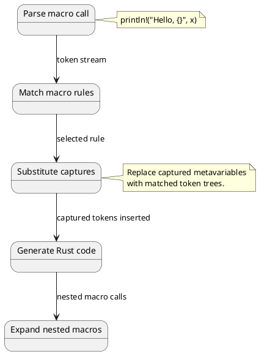
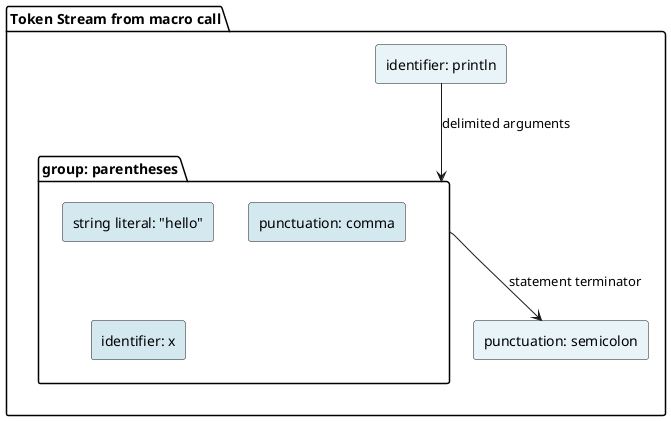
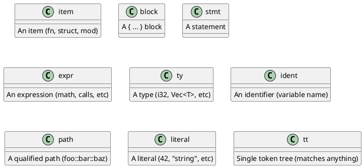
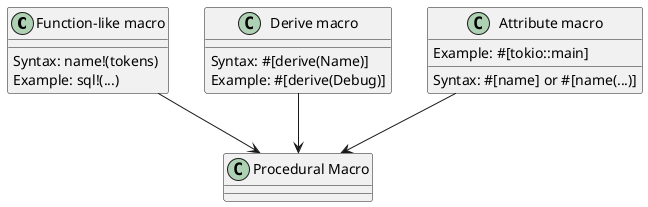

# Macros: Metaprogramming and Code Generation Under the Hood

## Overview
Rust macros are **code generation** systems that expand at compile time before type checking. Two types exist: **declarative macros** (pattern matching) and **procedural macros** (functions that manipulate token trees).

---

## 1. Declarative Macros (Macro Rules)

### Simple Macro Definition
```rust
macro_rules! println {
    ($($arg:tt)*) => {
        $crate::io::_print($crate::format_args!($($arg)*));
    };
}
```

### Macro Expansion Process



### Macro Rules Syntax
```rust
macro_rules! my_macro {
    () => {
        // Rule 1: Match zero arguments
    };
    ($a:expr) => {
        // Rule 2: Match one expression
    };
    ($($item:item)*) => {
        // Rule 3: Match zero or more items
    };
}
```

---

## 2. Token Trees

### What Are Tokens?
```rust
println!("hello", x, y + 2);

// Tokens:
// - Identifier: println
// - Punctuation: !
// - Literal: "hello"
// - Punctuation: ,
// - Identifier: x
// - Punctuation: ,
// - Identifier: y
// - Punctuation: +
// - Literal: 2
// - Punctuation: ;
```

### Macro Input: Token Stream



---

## 3. Capture Groups and Repetition

### Capture Syntax
```rust
macro_rules! repeat {
    ($item:expr, $($repeat:expr),*) => {
        // $item matches one expression
        // $($repeat),* matches comma-separated expressions
        // * = zero or more
        // + = one or more
        // ? = zero or one
    };
}

repeat!(value, a, b, c, d);  // item=value, repeat=[a,b,c,d]
```

### Repetition Semantics

```rust
macro_rules! repeat_expand {
    ($($item:expr),*) => {
        // $($item),* expands to:
        // If input: a, b, c
        // Output: a, b, c (same)
        // The * repeats the entire group
    };
}

repeat_expand!(1, 2, 3);
// Expands to: 1, 2, 3
```

---

## 4. Fragment Specifiers

### Available Types



### Using Fragment Specifiers
```rust
macro_rules! example {
    ($e:expr) => { /* ... */ };          // Matches expressions
    ($ty:ty) => { /* ... */ };           // Matches types
    ($id:ident) => { /* ... */ };        // Matches identifiers
    ($item:item) => { /* ... */ };       // Matches items (fn, struct, etc)
}
```

---

## 5. Macro Expansion Example

### Input Code
```rust
vec![1, 2, 3];
```

### Vec Macro Definition (Simplified)
```rust
macro_rules! vec {
    ($($element:expr),*) => {
        {
            let mut _v = Vec::new();
            $(_v.push($element);)*
            _v
        }
    };
}
```

### Expansion Process

```
Input tokens: [ 1, 2, 3 ]

Match rule: ($($element:expr),*)
Capture: $element = [1, 2, 3]

Substitute in template:
{
    let mut _v = Vec::new();
    _v.push(1);
    _v.push(2);
    _v.push(3);
    _v
}

Final code (type-checked):
{
    let mut _v: Vec<_> = Vec::new();
    _v.push(1);
    _v.push(2);
    _v.push(3);
    _v
}
```

---

## 6. Procedural Macros

### Three Types



---

## 7. Procedural Macro Implementation

### Function-Like Procedural Macro
```rust
use proc_macro::TokenStream;

#[proc_macro]
pub fn sql(input: TokenStream) -> TokenStream {
    // Parse token stream
    let sql_string = input.to_string();
    
    // Analyze SQL
    let analysis = analyze_sql(&sql_string);
    
    // Generate code
    quote! {
        PreparedStatement::new(#sql_string)
    }.into()
}
```

### Derive Macro
```rust
#[proc_macro_derive(MyTrait)]
pub fn derive_my_trait(input: TokenStream) -> TokenStream {
    // Parse the struct/enum
    let item = parse_macro_input!(input as DeriveInput);
    
    // Generate implementation
    let name = &item.ident;
    quote! {
        impl MyTrait for #name {
            // Auto-generated methods
        }
    }.into()
}
```

---

## 8. Macro Hygiene

### Hygiene Problem (Accidental Capture)
```rust
macro_rules! bad_macro {
    ($body:expr) => {
        let x = 1;
        $body  // If $body contains x, it's captured!
    };
}

let x = 10;
bad_macro!(println!("{}", x));  // Prints 1, not 10!
```

### Hygiene Solution
```rust
// Rust 2.0+ macro hygiene prevents accidental capture
// Variables from macro are "marked" as from macro context
// Outer x and inner x are in different scopes
```

### Gensym (Generated Symbols)
```rust
macro_rules! avoid_collision {
    () => {
        let __internal_var = 1;  // Unlikely to conflict
        // Or use quasi-quotation system in procedural macros
    };
}
```

---

## 9. Quote and Quasi-Quotation

### quote! Macro (Procedural)
```rust
use quote::quote;

let name = syn::parse_str::<syn::Ident>("MyStruct")?;
let expanded = quote! {
    impl Default for #name {
        fn default() -> Self {
            Self { /* ... */ }
        }
    }
};

// Generated code with interpolation (#name)
```

### Interpolation
```rust
let field_name = "x";
let field_type = quote! { i32 };

let generated = quote! {
    pub #field_name: #field_type,
};

// Produces: pub x: i32,
```

---

## 10. Common Macro Patterns

### Assert Macro
```rust
macro_rules! assert {
    ($cond:expr) => {
        if !($cond) {
            panic!("assertion failed: {}", stringify!($cond))
        }
    };
}

// stringify! converts token tree to string
```

### Debug Print Macro
```rust
macro_rules! dbg {
    ($val:expr) => {
        eprintln!("[{}:{}] {} = {:#?}", file!(), line!(), stringify!($val), $val)
    };
}

// file!() → current file name
// line!() → current line number
// stringify!() → convert tokens to string
```

---

## 11. Performance: Macros vs Functions

### Macro Overhead
```
Macro expansion: Happens at compile time (no runtime cost)
Code generation: Can produce inline-able code
Result: Often better than function (inlining opportunity)
```

### Comparison
```rust
// Macro (likely inlined):
macro_rules! add {
    ($a:expr, $b:expr) => { $a + $b };
}
let r = add!(x, y);  // Inlined as: x + y

// Function (might not inline):
fn add(a: i32, b: i32) -> i32 { a + b }
let r = add(x, y);   // May generate function call
```

---

## 12. Limitations of Macros

### Cannot Access Types
```rust
macro_rules! bad {
    ($val:expr) => {
        // No way to know type of $val at compile time!
        println!("{}", std::mem::size_of_val(&$val));  // WRONG
    };
}
```

### Solution: Procedural Macros
```rust
#[proc_macro]
pub fn size_of(input: TokenStream) -> TokenStream {
    // Parse the type
    let ty = parse_macro_input!(input as syn::Type);
    
    // Can access type information!
    quote! {
        std::mem::size_of::<#ty>()
    }.into()
}
```

---

## 13. Macro Debugging

### Expand Macros (cargo expand)
```bash
cargo install cargo-expand
cargo expand  # Shows generated code
```

### Manual Inspection
```rust
// Use println! in macro to debug expansion
macro_rules! debug_macro {
    ($x:expr) => {
        println!("Expanded with: {}", stringify!($x));
        $x
    };
}
```

---

## 14. Built-in Macros

### Compile-Time Constants
```rust
file!()      // Current file name
line!()      // Current line number
column!()    // Current column
module_path!() // Current module path
stringify!() // Convert tokens to string
concat!()    // Concatenate strings (compile-time)
env!()       // Environment variable
```

### Conditional Compilation
```rust
#[cfg(test)]
mod tests { }

#[cfg(unix)]
fn unix_only() { }

#[cfg_attr(doc, doc = "...")]
pub struct S;
```

---

## Summary

| Aspect | Declarative | Procedural |
|--------|-------------|-----------|
| **Define** | macro_rules! | #[proc_macro] |
| **Pattern Matching** | Yes | No (uses Syn crate) |
| **Type Access** | No | Yes (via Syn) |
| **Hygiene** | Automatic | Manual (quote!) |
| **Learning Curve** | Moderate | Steep |

---

**Next:** [Optimization →](21-optimization.md) Learn compiler optimizations and zero-cost abstractions.
