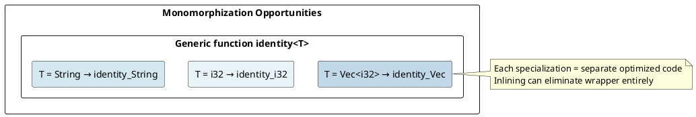
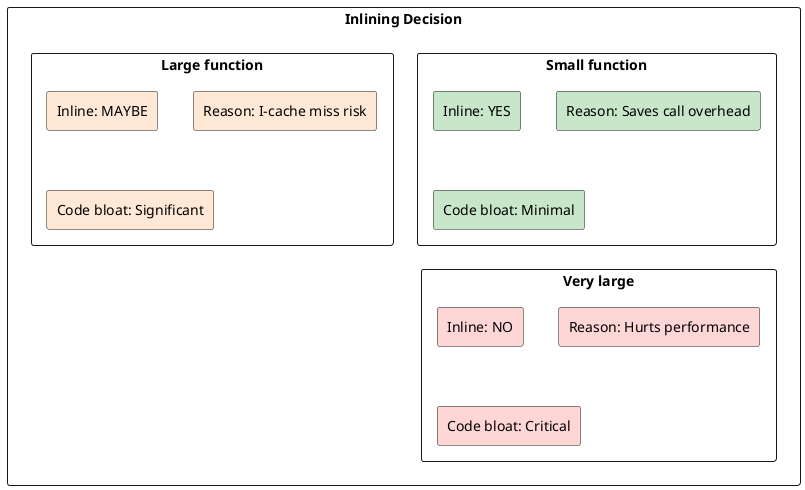

# Optimization: Compiler Optimizations and Zero-Cost Abstractions

## Overview
Rust abstractions (generics, traits, closures) compile away, producing the **same machine code** as hand-optimized C. Understanding optimizations helps write efficient code and predict performance.

---

## 1. Inlining

### What is Inlining?
```rust
fn add(a: i32, b: i32) -> i32 {
    a + b
}

let result = add(x, y);
```

### Without Inlining (Unoptimized)
```asm
call add        ; Call function
; add function:
add rax, rbx    ; Add values
ret             ; Return
```

### With Inlining (Optimized)
```asm
add rax, rbx    ; Add values directly (no call!)
```

**Result:** 10-50 CPU cycles saved per call elimination.

### Inline Hints
```rust
#[inline]       // Hint: inline this
#[inline(never)]  // Never inline
#[inline(always)] // Always inline (weak hint)

pub fn inlined() { }       // Default: compiler decides
pub fn never_inline() { }  // Prevent inlining
```

---

## 2. Monomorphization Optimization

### Specialization
```rust
fn identity<T>(x: T) -> T {
    x
}

let i = identity(42);     // Generates: identity_i32
let s = identity("hello"); // Generates: identity_str
```

### Code Generation



### LLVM Optimization
```
identity_i32(x):
  return x           ; x in rax, direct return

identity_String(x):
  return x           ; x in rdi (pointer), direct return
```

**Result:** Zero overhead over manual specialization.

---

## 3. Dead Code Elimination

### Unused Code Removal
```rust
fn unused() {
    let x = expensive_computation();  // Never used
}

fn caller() {
    unused();  // Function called but side effects removed
}
```

### Optimization Result
```asm
; Dead code eliminated entirely!
caller:
    ret        ; Function is now a no-op
```

---

## 4. Loop Unrolling

### Small Loops
```rust
for i in 0..4 {
    buffer[i] = i as u8;
}
```

### Unrolled Version
```asm
mov byte [buffer + 0], 0
mov byte [buffer + 1], 1
mov byte [buffer + 2], 2
mov byte [buffer + 3], 3
```

**Result:** No loop overhead for small, known-size loops.

---

## 5. Vectorization (SIMD)

### Auto-Vectorization
```rust
for i in 0..1000 {
    result[i] = a[i] + b[i];  // Can be vectorized
}
```

### Vectorized Code
```asm
movdqa xmm0, [a + 0]    ; Load 4 i32s
movdqa xmm1, [b + 0]    ; Load 4 i32s
paddd xmm0, xmm1        ; Add 4 values simultaneously
movdqa [result], xmm0   ; Store 4 results
```

**Result:** 4× faster (on SSE), 8× with AVX2.

---

## 6. Branch Prediction

### Predictable Branches
```rust
for item in items {
    if item.valid {        // Usually true
        process(item);
    }
}
```

### Compiler Optimization
```asm
cmp rax, 0              ; Check if valid
jne .process            ; Branch (likely to be taken)
jmp .next_item

.process:
    call process
.next_item:
    ; Continue loop
```

**Prediction:** CPU guesses which way branch goes. Correct guess = no penalty. Wrong guess = 20+ cycle stall.

### Branch Hints (Unstable)
```rust
if core::intrinsics::likely(condition) {
    // Hint to compiler: this branch is usually taken
}
```

---

## 7. Constant Folding

### Compile-Time Computation
```rust
const BUFFER_SIZE: usize = 4 * 1024;  // Computed at compile time
const TAU: f64 = 2.0 * std::f64::consts::PI;  // Folded to constant
```

### Result
```asm
mov rax, 4096    ; Constant directly in code
```

**Cost:** Zero runtime overhead.

---

## 8. Function Pointer Optimization

### Virtual Function Calls (Vtable)
```rust
trait Animal { fn speak(&self); }

fn call_animal(a: &dyn Animal) {
    a.speak();  // Dynamic dispatch (vtable lookup)
}
```

### Monomorphization (Devirtualization)
```rust
fn call_animal<T: Animal>(a: &T) {
    a.speak();  // Static dispatch (inline-able!)
}

call_animal(&dog);   // Can inline Dog::speak()
call_animal(&cat);   // Can inline Cat::speak()
```

**Compiler can devirtualize** when concrete type known.

---

## 9. Escape Analysis

### Stack vs Heap
```rust
// Without escape analysis (pessimistic):
let v = Vec::new();
let ptr = Box::new(v);  // Allocates unnecessarily

// With escape analysis (optimistic):
// Compiler sees v never escapes Box
// Optimizes to stack allocation
```

### Scalar Replacement of Aggregates
```rust
struct Point { x: i32, y: i32 }

let p = Point { x: 10, y: 20 };
let x = p.x;
```

### Optimized
```asm
mov rax, 10    ; x directly in register
; Point struct eliminated
```

---

## 10. Inlining and Specialization Trade-offs

### Code Size vs Speed



---

## 11. LTO: Link-Time Optimization

### Whole-Program Optimization
```toml
# Cargo.toml
[profile.release]
lto = true      # Enable LTO (slower compile, faster binary)
codegen-units = 1  # Single codegen unit (better optimization)
```

### LTO Benefits
```
Without LTO:
- Each crate compiled independently
- Can't inline across crates

With LTO:
- Link time: Entire program re-optimized
- Can inline across crate boundaries
- 5-20% faster binaries (at cost of compile time)
```

---

## 12. SIMD Intrinsics

### Manual SIMD Optimization
```rust
use std::arch::x86_64::*;

unsafe fn add_vectors(a: &[f32], b: &[f32]) -> Vec<f32> {
    let mut result = vec![0.0; a.len()];
    
    for i in (0..a.len()).step_by(4) {
        let av = _mm_loadu_ps(&a[i]);    // Load 4 floats
        let bv = _mm_loadu_ps(&b[i]);    // Load 4 floats
        let sum = _mm_add_ps(av, bv);    // Add 4 at once
        _mm_storeu_ps(&mut result[i], sum); // Store 4 results
    }
    
    result
}
```

**Result:** 4-8× faster than scalar loop.

---

## 13. Profile-Guided Optimization (PGO)

### Using PGO
```bash
# Profile: run program to collect data
RUSTFLAGS="-C profile-use=profiles/default.profraw" cargo build -O

# Optimize with profile data
RUSTFLAGS="-C llvm-args=-pgo-warn-missing-function" cargo build -O
```

**Compiler optimizes based on actual runtime patterns.**

---

## 14. Benchmarking

### Criterion Benchmarking
```rust
use criterion::{black_box, criterion_group, criterion_main, Criterion};

fn fibonacci(n: u32) -> u32 {
    match n {
        0 | 1 => 1,
        _ => fibonacci(n - 1) + fibonacci(n - 2),
    }
}

fn criterion_benchmark(c: &mut Criterion) {
    c.bench_function("fib 10", |b| {
        b.iter(|| fibonacci(black_box(10)))  // black_box prevents optimization
    });
}

criterion_group!(benches, criterion_benchmark);
criterion_main!(benches);
```

### Black Box
```rust
black_box(x)  // Prevent compiler from optimizing away computation
```

---

## 15. Compiler Flags for Optimization

### Release Profile
```toml
[profile.release]
opt-level = 3           # 0-3, or "z" for size
lto = true              # Link-time optimization
codegen-units = 1       # Single unit for better optimization
strip = true            # Strip debug symbols
```

### Debug Profile
```toml
[profile.dev]
opt-level = 0           # Fast compilation
debug = true            # Include debug symbols
```

### Custom Profile
```toml
[profile.profiling]
inherits = "release"
debug = true            # Keep debug info in release
```

---

## 16. Zero-Cost Abstraction Examples

### Iterator Abstractions
```rust
// High-level
let sum: i32 = (0..1000)
    .map(|x| x * 2)
    .filter(|x| x % 3 == 0)
    .sum();

// Compiles to:
let mut sum = 0;
for i in 0..1000 {
    let x = i * 2;
    if x % 3 == 0 {
        sum += x;
    }
}
```

**Result:** Identical machine code (iterators eliminated).

---

## 17. Common Optimization Pitfalls

### WRONG: Over-Optimizing
```rust
// Premature optimization
let v: Vec<u32> = vec![1, 2, 3];
let cached_len = v.len();  // Caching length (compiler optimizes this anyway!)
```

### CORRECT: Trust Compiler
```rust
let v: Vec<u32> = vec![1, 2, 3];
for i in 0..v.len() {
    // Compiler optimizes v.len() to constant
}
```

---

## Summary

| Optimization | When | Overhead |
|--------------|------|----------|
| **Inlining** | Small functions | 0 (saves CPU cycles) |
| **Monomorphization** | Generics | 0 (replaces monomorphic) |
| **Dead code elimination** | Unused | 0 (removes) |
| **Vectorization** | Simple loops | 4-8× faster |
| **LTO** | Whole program | 10-20% faster (slower compile) |

---

**Next:** [Advanced Topics →](22-advanced.md) Learn unsafe, FFI, SIMD, allocators, const generics.
