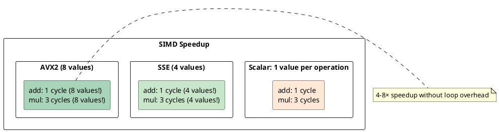
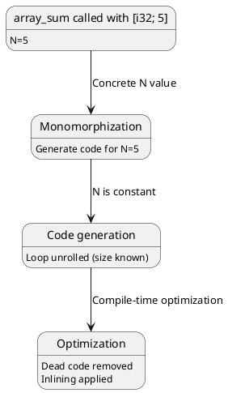

# Advanced Topics: Unsafe, FFI, SIMD, Allocators, Const Generics

## Overview
Advanced Rust features enable systems programming: **unsafe** bypasses borrow checker (with responsibility), **FFI** calls C/C++ code, **SIMD** exploits hardware parallelism, **custom allocators** control memory management, and **const generics** add compile-time parameters.

---

## 1. Unsafe Blocks

### Unsafe Capabilities
```rust
unsafe {
    // 1. Dereference raw pointers
    let ptr: *const i32 = &42;
    let value = *ptr;

    // 2. Call unsafe functions
    libc::printf(b"Hello\n");

    // 3. Mutate static variables
    static mut COUNTER: u32 = 0;
    COUNTER += 1;

    // 4. Implement unsafe traits
    // impl UnsafeTrait for MyType { }
}
```

### Safety Invariants (Programmer's Responsibility)
```rust
unsafe fn dereference_option(ptr: Option<&i32>) -> i32 {
    // SAFETY: Option is non-null, so unwrap_unchecked is safe
    *ptr.unwrap_unchecked()
}
```

---

## 2. Raw Pointers

### Creating Raw Pointers
```rust
let x = 42;
let ptr_imm: *const i32 = &x as *const i32;     // Immutable
let mut y = 10;
let ptr_mut: *mut i32 = &mut y as *mut i32;    // Mutable
```

### Dereferencing Raw Pointers
```rust
unsafe {
    *ptr_mut = 20;           // Dereference mutable
    let val = *ptr_imm;      // Dereference immutable
}
```

### Pointer Arithmetic
```rust
unsafe {
    let arr = [1, 2, 3, 4, 5];
    let ptr = arr.as_ptr();
    
    let elem0 = *ptr;           // arr[0]
    let elem1 = *(ptr.add(1));  // arr[1]
}
```

---

## 3. FFI: Foreign Function Interface

### Calling C Code
```rust
extern "C" {
    fn strlen(s: *const u8) -> usize;
}

fn get_length(s: &str) -> usize {
    unsafe {
        strlen(s.as_ptr())
    }
}
```

### Memory Layout Guarantees
```rust
use std::ffi::CStr;

#[repr(C)]
struct Point {
    x: i32,
    y: i32,
}

// #[repr(C)] ensures C-compatible memory layout
// Without it: field ordering might differ
```

### Calling Convention
```rust
extern "C" fn rust_callback(value: i32) -> i32 {
    value * 2
}

// extern "C" uses C calling convention
// Allows C code to call Rust functions
```

### C String Handling
```rust
use std::ffi::{CStr, CString};

// Rust String → C string (null-terminated)
let c_str = CString::new("hello").unwrap();
let c_ptr: *const i8 = c_str.as_ptr();

unsafe {
    // C string → Rust String
    let c_str_ref = CStr::from_ptr(c_ptr);
    let rust_str = c_str_ref.to_str().unwrap();
}
```

---

## 4. SIMD Intrinsics

### SSE/AVX Operations
```rust
#[cfg(target_arch = "x86_64")]
use std::arch::x86_64::*;

fn vector_add(a: &[f32; 4], b: &[f32; 4]) -> [f32; 4] {
    unsafe {
        let av = _mm_loadu_ps(a.as_ptr());    // Load 4 floats
        let bv = _mm_loadu_ps(b.as_ptr());    // Load 4 floats
        let sum = _mm_add_ps(av, bv);         // Add (4 at once)
        
        let mut result = [0.0; 4];
        _mm_storeu_ps(result.as_mut_ptr(), sum); // Store 4 floats
        result
    }
}
```

### SIMD Performance



### Portable SIMD (Unstable)
```rust
#![feature(portable_simd)]

use std::simd::*;

fn vector_add(a: [f32; 4], b: [f32; 4]) -> [f32; 4] {
    let av = Simd::from_array(a);
    let bv = Simd::from_array(b);
    (av + bv).to_array()  // Compiler generates SIMD
}
```

---

## 5. Global Allocators

### Custom Allocator
```rust
use std::alloc::{GlobalAlloc, Layout};

struct MyAllocator;

unsafe impl GlobalAlloc for MyAllocator {
    unsafe fn alloc(&self, layout: Layout) -> *mut u8 {
        // Custom allocation logic
        libc::malloc(layout.size()) as *mut u8
    }

    unsafe fn dealloc(&self, ptr: *mut u8, _layout: Layout) {
        libc::free(ptr as *mut libc::c_void);
    }
}

#[global_allocator]
static GLOBAL: MyAllocator = MyAllocator;
```

### Allocator Trait
```rust
unsafe impl GlobalAlloc for MyAllocator {
    unsafe fn alloc(&self, layout: Layout) -> *mut u8 { ... }
    unsafe fn dealloc(&self, ptr: *mut u8, layout: Layout) { ... }
    unsafe fn realloc(&self, ptr: *mut u8, old: Layout, new: Layout) -> *mut u8 { ... }
}
```

---

## 6. Memory-Mapped I/O

### Mmap Example
```rust
use std::os::unix::io::AsRawFd;

unsafe fn mmap_file(file: &std::fs::File, size: usize) -> *mut u8 {
    libc::mmap(
        std::ptr::null_mut(),
        size,
        libc::PROT_READ | libc::PROT_WRITE,
        libc::MAP_SHARED,
        file.as_raw_fd(),
        0
    ) as *mut u8
}
```

---

## 7. Const Generics

### Const Parameters
```rust
fn array_sum<const N: usize>(arr: [i32; N]) -> i32 {
    arr.iter().sum()
}

let sum = array_sum([1, 2, 3, 4, 5]);  // N = 5
```

### Const Evaluation



### Benefits
```rust
// Without const generics (slow):
fn make_vec(size: usize) -> Vec<i32> {
    vec![0; size]  // Runtime allocation
}

// With const generics (fast):
fn make_array<const N: usize>() -> [i32; N] {
    [0; N]  // Stack allocation
}
```

---

## 8. Volatile Operations

### Preventing Compiler Optimizations
```rust
use std::ptr;

let x = 42;
let ptr = &x as *const i32;

unsafe {
    let val = ptr::read_volatile(ptr);  // Can't optimize away
}
```

### Use Cases
```rust
// Memory-mapped register (real hardware)
unsafe {
    let reg = 0xFFFF0000 as *mut u32;
    ptr::write_volatile(reg, value);  // Must write (can't optimize away)
}
```

---

## 9. Intrinsics

### LLVM Intrinsics
```rust
extern "llvm_intrinsic" {
    fn llvm_x86_sse2_paddd_128(a: i32x4, b: i32x4) -> i32x4;
}

unsafe {
    let sum = llvm_x86_sse2_paddd_128(a, b);
}
```

### Compiler Intrinsics
```rust
use core::intrinsics::*;

unsafe {
    rotate_left(value, bits);     // CPU rotate instruction
    unchecked_add(a, b);           // Addition without overflow check
    abort();                       // Immediate abort
}
```

---

## 10. Inline Assembly

### asm! Macro
```rust
use std::arch::asm;

fn add_one(mut x: i32) -> i32 {
    unsafe {
        asm!(
            "add {0}, 1",
            inout(reg) x,
        );
    }
    x
}

// Generates: add eax, 1
```

### Operand Constraints
```rust
unsafe {
    asm!(
        "add {0}, {1}",
        inout(reg) dst,     // inout = read and write
        in(reg) src,        // in = read only
    );
}
```

---

## 11. Type Safety in Unsafe Code

### Soundness vs Type Safety
```rust
// Type-safe but unsound:
unsafe fn transmute_wrong<T, U>(t: T) -> U {
    std::mem::transmute(t)  // Reinterpret bytes (unsound!)
}

// This breaks safety if:
let ptr: *const i32 = transmute_wrong::<_, _>(&42.0);  // Wrong size!
```

### Correct Unsafe Code
```rust
// Sound:
unsafe fn transmute_correct<T, U>(t: T) -> U
where
    T: Copy,
    U: Copy,
{
    if std::mem::size_of::<T>() != std::mem::size_of::<U>() {
        panic!("Size mismatch");  // Check at runtime
    }
    std::mem::transmute(t)
}
```

---

## 12. Unsafe Trait Implementation

### Example: Marker Trait
```rust
unsafe trait UnsafeTrait {
    // Types implementing this must guarantee...
    // ...some property checked at compile time
}

unsafe impl UnsafeTrait for MyType {
    // Implementation must maintain invariants
    // Compiler trusts programmer
}
```

### Example: Send Trait
```rust
// Manual Send implementation (usually auto-derived):
unsafe impl Send for MyPtr {
    // Compiler won't derive Send for custom types containing raw pointers
    // Programmer must implement to prove it's thread-safe
}
```

---

## 13. Advanced Memory Safety Patterns

### Pinning
```rust
use std::pin::Pin;

fn requires_pin<T: Unpin>(t: Pin<&mut T>) {
    // t cannot be moved (even after unpinned)
}
```

### Self-Referential Structs
```rust
struct SelfRef {
    data: i32,
    ptr_to_data: *const i32,  // Unsafe: points to own field
}

// Must use Pin to prevent moving
let s = Pin::new(Box::new(SelfRef { ... }));
```

---

## 14. Summary Table

| Feature | Safety | Performance | Use Case |
|---------|--------|-------------|----------|
| **Unsafe** | Programmer-checked | Best | FFI, atomics, optimization |
| **FFI** | Interop-dependent | Native | C integration |
| **SIMD** | Compiler-checked | 4-8× faster | Vector operations |
| **Custom Allocator** | Allocator-dependent | Customizable | Specialized memory |
| **Const Generics** | Compile-time | Zero overhead | Array sizes, compile-time math |

---

## 15. Safe Abstractions over Unsafe

### Example: SafeVec
```rust
pub struct SafeVec<T> {
    ptr: *mut T,
    cap: usize,
    len: usize,
}

impl<T> SafeVec<T> {
    pub fn push(&mut self, val: T) {
        unsafe {
            if self.len == self.cap {
                self.grow();
            }
            (*self.ptr.add(self.len)) = val;
            self.len += 1;
        }
    }

    pub fn get(&self, idx: usize) -> Option<&T> {
        if idx < self.len {
            unsafe { Some(&*self.ptr.add(idx)) }
        } else {
            None
        }
    }
}

// Safe interface hides unsafe internals
```

---

**Next:** [Real-World Examples →](23-examples.md) Combining all concepts in practical applications.
