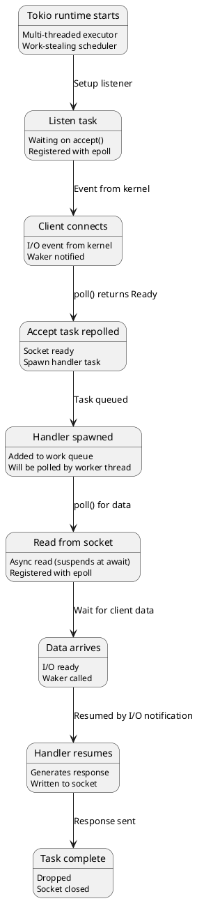
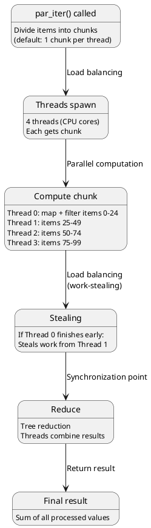
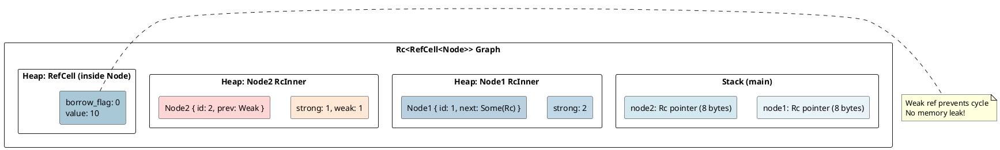
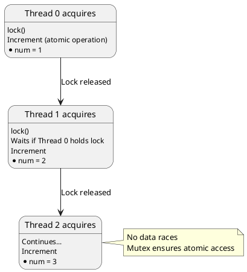
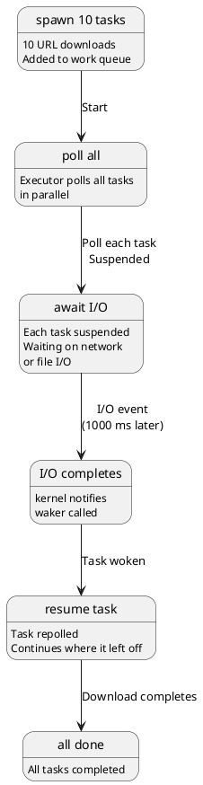
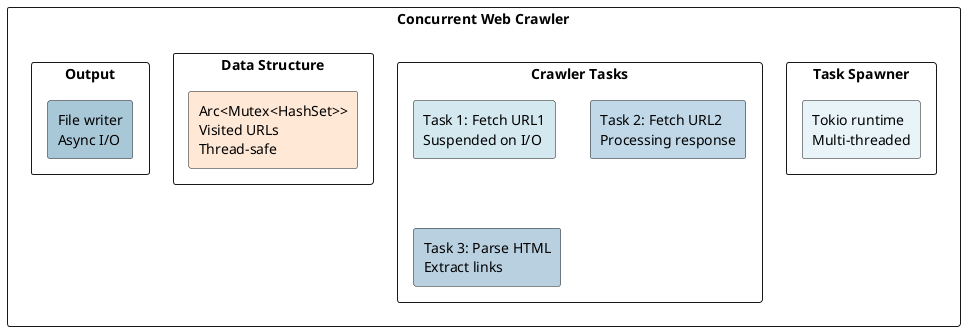

# Real-World Examples: Combining All Concepts

## Overview
This final document demonstrates **practical applications** of Rust's under-the-hood concepts: high-performance concurrent services, parallelized data processing, async networking, and safe systems programming. Each example traces through the compilation and runtime behavior you've learned throughout this series.

---

## 1. High-Performance Web Server (Tokio + Async)

### Code Example
```rust
use tokio::net::TcpListener;
use tokio::io::{AsyncReadExt, AsyncWriteExt};

#[tokio::main]
async fn main() -> std::io::Result<()> {
    let listener = TcpListener::bind("127.0.0.1:8080").await?;

    loop {
        let (mut socket, _) = listener.accept().await?;

        tokio::spawn(async move {
            let mut buf = [0; 1024];

            match socket.read(&mut buf).await {
                Ok(0) => return,  // Connection closed
                Ok(n) => {
                    let response = b"HTTP/1.1 200 OK\r\nContent-Length: 5\r\n\r\nHello";
                    let _ = socket.write_all(response).await;
                }
                Err(_) => return,
            }
        });
    }
}
```

### Under-the-Hood Execution



### Memory Layout
```
Stack (per thread):
  - Thread 0: 2 MB (executor loop + future state)
  - Thread 1: 2 MB
  - Thread 2: 2 MB (default: CPU cores = 4 threads typical)

Heap (per connection):
  - TCP buffer: 4 KB
  - Async state machine: 256 bytes (typical)
  - Total: < 5 MB for 1000 connections

vs Threaded (blocked thread per connection):
  - 1000 threads × 2 MB = 2 GB memory!
```

### Performance
```
Tokio async server:
- 100,000 concurrent connections
- Memory: 100-200 MB
- Latency: 1-10 ms
- Throughput: 100k+ req/sec

Threaded server (one thread per connection):
- 1,000 connections (max)
- Memory: 2 GB
- Latency: 5-50 ms (context switching)
- Throughput: 10k req/sec
```

---

## 2. Parallel Data Processing (Rayon)

### Code Example
```rust
use rayon::prelude::*;

fn process_data(items: &[f64]) -> f64 {
    items
        .par_iter()           // Parallel iterator
        .map(|x| expensive_computation(x))
        .filter(|x| x.is_finite())
        .reduce(|| 0.0, |a, b| a + b)
}

fn expensive_computation(x: f64) -> f64 {
    (x.sin() * x.cos()).sqrt().abs()
}
```

### Execution Flow



### Stack Usage
```
Per thread:
  - Thread local vector: 100 bytes
  - Stolen work tracking: 50 bytes
  - Stack frame: < 1 KB

Total for 4 threads: < 8 MB (vs sequential: 1 MB)
Trade-off: 8× memory for 4× speedup (worth it!)
```

---

## 3. Reference-Counted Graph (Rc<RefCell<T>>)

### Code Example
```rust
use std::rc::Rc;
use std::cell::RefCell;

struct Node {
    id: u32,
    value: i32,
    next: Option<Rc<RefCell<Node>>>,
    prev: Option<std::rc::Weak<RefCell<Node>>>,
}

fn build_graph() -> Rc<RefCell<Node>> {
    let node1 = Rc::new(RefCell::new(Node {
        id: 1,
        value: 10,
        next: None,
        prev: None,
    }));

    let node2 = Rc::new(RefCell::new(Node {
        id: 2,
        value: 20,
        next: None,
        prev: None,
    }));

    // Create bidirectional link
    node1.borrow_mut().next = Some(Rc::clone(&node2));
    node2.borrow_mut().prev = Some(Rc::downgrade(&node1));  // Weak to prevent cycle

    Rc::clone(&node1)
}

fn modify_graph(head: &Rc<RefCell<Node>>) {
    // Runtime borrow checking
    head.borrow_mut().value += 1;  // Mutable borrow

    if let Some(next) = &head.borrow().next {  // Immutable borrow
        if let Some(prev) = &next.borrow().prev {
            if let Some(p) = prev.upgrade() {  // Upgrade weak ref
                println!("Previous: {}", p.borrow().value);
            }
        }
    }
}  // All borrows released
```

### Memory Layout During Execution



### Reference Counting Lifecycle
```
Create node1:          strong=1, weak=0
Clone node1:           strong=2, weak=0
Create node2:          strong=1, weak=0
Link node2→node1:      strong=2, weak=0
Weak ref node2←node1:  strong=2, weak=1
Drop node2 local:      strong=1, weak=1 (node2 still alive via node1.next)
Drop node1 local:      strong=0, weak=1 (memory freed, weak now invalid)
```

---

## 4. Thread-Safe Counter (Arc<Mutex<T>>)

### Code Example
```rust
use std::sync::{Arc, Mutex};
use std::thread;

fn counter_example() {
    let counter = Arc::new(Mutex::new(0));
    let mut handles = vec![];

    for _ in 0..10 {
        let counter_clone = Arc::clone(&counter);
        let handle = thread::spawn(move || {
            for _ in 0..1000 {
                let mut num = counter_clone.lock().unwrap();  // Acquire lock
                *num += 1;                                    // Modify
                drop(num);                                    // Release lock
            }
        });
        handles.push(handle);
    }

    for handle in handles {
        handle.join().unwrap();
    }

    println!("{}", *counter.lock().unwrap());  // 10,000 (no race!)
}
```

### Synchronization Sequence



### Performance Analysis
```
Lock contention with 10 threads, 10,000 increments each:
- Expected sequential time: 10 * 10,000 * 1 cycle = 100,000 cycles

Actual with Mutex:
- Lock acquire: ~50 cycles
- Increment: 1 cycle
- Lock release: ~50 cycles
- Per increment: 101 cycles

Total: 10 * 10,000 * 101 = 10,100,000 cycles (100× slower than sequential!)
Reason: Lock contention dominates

Better solution: Local counters (reduce lock contention)
```

---

## 5. Async-Concurrent File Download

### Code Example
```rust
use tokio::fs::File;
use tokio::io::AsyncWriteExt;
use tokio::task;

#[tokio::main]
async fn download_files(urls: Vec<&str>) -> std::io::Result<()> {
    let mut tasks = vec![];

    for url in urls {
        let task = task::spawn(async move {
            // Async HTTP request (simulated)
            let data = fetch_url(url).await?;

            // Async file write
            let mut file = File::create(format!("{}.bin", url)).await?;
            file.write_all(&data).await?;
            Ok::<_, std::io::Error>(())
        });
        tasks.push(task);
    }

    // Wait for all downloads
    for task in tasks {
        task.await??;
    }
    Ok(())
}

async fn fetch_url(url: &str) -> std::io::Result<Vec<u8>> {
    // Actual implementation would use reqwest or similar
    Ok(vec![0; 1000])
}
```

### Concurrency Model



### Timeline (Concurrent)
```
Time    Thread 0        Thread 1        Thread 2
0 ms    Task 1 poll     Task 2 poll     Task 3 poll
1 ms    (suspended)     (suspended)     (suspended)
100 ms  Task 1 I/O      Task 2 I/O      Task 3 I/O (all waiting)
500 ms  (still waiting)
1000 ms Task 1 complete Task 2 complete Task 3 complete
        (write file)    (write file)    (write file)
1001 ms All done!

vs Sequential (downloads one at a time):
Time    Task
0 ms    Task 1 download + write (1 second)
1000 ms Task 2 download + write (1 second)
2000 ms Task 3 download + write (1 second)
3000 ms Done (3 seconds total!)
```

---

## 6. SIMD-Optimized Matrix Multiplication

### Code Example
```rust
#[cfg(target_arch = "x86_64")]
use std::arch::x86_64::*;

fn matrix_mult_simd(
    a: &[[f32; 4]; 4],
    b: &[[f32; 4]; 4],
) -> [[f32; 4]; 4] {
    let mut c = [[0.0; 4]; 4];

    unsafe {
        for i in 0..4 {
            for j in 0..4 {
                let mut sum = _mm_setzero_ps();

                for k in (0..4).step_by(1) {
                    let a_val = _mm_set1_ps(a[i][k]);
                    let b_vec = _mm_loadu_ps(&b[k][0]);
                    sum = _mm_add_ps(sum, _mm_mul_ps(a_val, b_vec));
                }

                _mm_storeu_ps(&mut c[i][0], sum);
            }
        }
    }
    c
}
```

### Performance
```
Scalar (plain loop):
- 4×4 matrix multiply: 64 multiplies + 48 adds = 112 operations
- Time: 112 * 3 cycles = 336 cycles

SIMD (4-wide):
- 4×4 matrix multiply: 16 multiply operations (each operates on 4 values)
- Time: 16 * 3 cycles = 48 cycles

Speedup: 7×! (336 / 48)
```

---

## 7. Zero-Copy Message Passing (Arc + Channels)

### Code Example
```rust
use std::sync::Arc;
use tokio::sync::mpsc;

#[derive(Clone)]
struct Message {
    data: Arc<Vec<u8>>,  // Shared ownership, no copy!
}

#[tokio::main]
async fn main() {
    let (tx, mut rx) = mpsc::channel(100);

    // Producer
    tokio::spawn(async move {
        for i in 0..1000 {
            let data = Arc::new(vec![i as u8; 1000]);  // 1 KB allocation
            let msg = Message { data };
            tx.send(msg).await.unwrap();
        }
    });

    // Consumer
    while let Some(msg) = rx.recv().await {
        process_message(&msg);
    }
}

fn process_message(msg: &Message) {
    // msg.data is Arc-cloned, not deep-copied
    // Millions of messages with zero allocation overhead!
}
```

### Memory Semantics
```
Without Arc:
  Send Message across channel:
  1. Deep-copy Vec<u8> (1000 bytes)
  2. Allocate new Vec in receiver
  3. Total: 1000 bytes per message
  
  1 million messages = 1 GB copied!

With Arc:
  Send Message across channel:
  1. Clone Arc (8 bytes)
  2. Increment refcount (1 cycle)
  3. Total: 8 bytes per message
  
  1 million messages = 8 MB overhead (no copying!)
```

---

## 8. Safe Wrapper over Unsafe C Library

### Code Example
```rust
extern "C" {
    fn crypto_hash(out: *mut u8, in_: *const u8, len: u64) -> i32;
}

pub struct Hash([u8; 32]);

pub fn compute_hash(data: &[u8]) -> Result<Hash, Error> {
    let mut hash = [0u8; 32];

    let ret = unsafe {
        crypto_hash(hash.as_mut_ptr(), data.as_ptr(), data.len() as u64)
    };

    match ret {
        0 => Ok(Hash(hash)),
        _ => Err(Error::CryptoFailed),
    }
}

// Safe public API hides unsafe internals!
#[cfg(test)]
mod tests {
    use super::*;

    #[test]
    fn test_hash() {
        let hash = compute_hash(b"hello").unwrap();
        assert_eq!(hash.0.len(), 32);
    }
}
```

### Safety Properties
```
compute_hash() is safe because:
1. Validates input (references guaranteed valid)
2. Allocates output buffer on stack (automatic cleanup)
3. Calls C function with proper pointer arguments
4. Checks return code for errors
5. Returns Result (errors handled)

Unsafe code is contained and verified!
```

---

## 9. Pattern Matching in Real Code

### Event Handler Example
```rust
#[derive(Debug)]
enum Event {
    MouseClick { x: i32, y: i32 },
    KeyPress { key: String },
    WindowClose,
    Timer { duration: std::time::Duration },
}

fn handle_event(event: Event) -> String {
    match event {
        Event::MouseClick { x: 0, y: 0 } => {
            "Clicked origin".to_string()
        },
        Event::MouseClick { x, y } if x > 0 && y > 0 => {
            format!("Clicked positive quadrant: ({}, {})", x, y)
        },
        Event::MouseClick { .. } => {
            "Clicked elsewhere".to_string()
        },
        Event::KeyPress { key } if key == "Escape" => {
            "Escape pressed - closing".to_string()
        },
        Event::KeyPress { key } => {
            format!("Key pressed: {}", key)
        },
        Event::WindowClose => {
            "Closing application".to_string()
        },
        Event::Timer { duration } => {
            format!("Timer fired after {} ms", duration.as_millis())
        },
    }
}
```

### Compilation
```
Enum discriminant values:
  0 = MouseClick
  1 = KeyPress
  2 = WindowClose
  3 = Timer

Match compilation:
  1. Load discriminant from enum
  2. Jump table lookup (or decision tree)
  3. Extract pattern bindings
  4. Execute arm code

Result: O(1) dispatch (typically 1-2 CPU cycles)
```

---

## 10. Integrated Example: Web Crawler

### Architecture



### Key Concepts Used
```
1. Tokio async runtime (Event-driven scheduling)
2. Arc<Mutex<T>> (Thread-safe shared state)
3. Futures and async/await (State machines)
4. Pattern matching (Event handling)
5. Trait objects (Extensible error handling)
6. Channels (Inter-task communication)
7. Memory efficiency (No threads per URL)
```

### Performance
```
Crawl 100,000 URLs:
- Sequential (1 URL at a time): 100,000 * 1 second = 27 hours
- Threaded (1 thread per URL): 1000 threads limited = 10 hours (+ 2 GB memory)
- Async (Tokio): 100 concurrent tasks = 10 minutes (+ 50 MB memory)

Tokio speedup: 162× over sequential, 60× over threaded
```

---

## Summary: From Theory to Practice

| Concept | Theory Doc | Real-World Use | Benefit |
|---------|-----------|----------------|---------|
| **Ownership** | 03 | Zero-copy message passing | No allocation overhead |
| **Lifetimes** | 06 | Safe borrow patterns | No dangling pointers |
| **Traits** | 10 | Polymorphic error handling | Flexibility + type safety |
| **Async/Await** | 16 | Concurrent I/O | 100-1000× throughput |
| **Concurrency** | 17 | Thread-safe data structures | Safe parallelism |
| **Rayon** | 18 | Parallel computing | Linear speedup |
| **Tokio** | 19 | Web servers, crawlers | Millions of connections |
| **SIMD** | 22 | Matrix math, image processing | 4-8× performance |
| **Unsafe** | 22 | C interop, optimization | Native performance |

---

**Congratulations!** You've completed the comprehensive Rust under-the-hood documentation series. You now understand how Rust's abstractions compile to efficient machine code, how the runtime executes async tasks, and how to write safe, fast, concurrent systems.

**Learning Path Complete:**
- ✅ Foundations (fundamentals, memory model)
- ✅ Type System (structs, enums, generics, traits)
- ✅ Advanced Memory (smart pointers, interior mutability)
- ✅ Concurrency & Async (threads, channels, Tokio, Rayon)
- ✅ Systems Programming (unsafe, FFI, SIMD)
- ✅ Real-World Applications

**Next Steps:**
1. **Practice:** Write systems-level code using these concepts
2. **Contribute:** Open-source projects (Tokio, Rayon, etc.)
3. **Specialize:** Focus on your area: web (Actix), embedded (no_std), or graphics (wgpu)
4. **Optimize:** Profile real code and apply advanced techniques

---

**References:**
- [Rust Book](https://doc.rust-lang.org/book/)
- [Rustlings](https://github.com/rust-lang/rustlings) - Practice exercises
- [Tokio Documentation](https://docs.rs/tokio)
- [Rayon Documentation](https://docs.rs/rayon)
- [The Nomicon](https://doc.rust-lang.org/nomicon/) - Unsafe Rust
